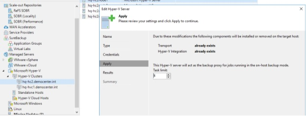

# Hyper-V backup modes #

Veeam Backup and Replication provides two different backup modes to process Hyper-V backups, both relying on the Microsoft VSS framework.
- **On-Host** backup mode, for which backup data processing is on the Hyper-V node hosting the VM, leveraging non transportable shadow copies by using software VSS provider.
- **Off-Host** backup mode, for which backup data processing is offloaded to another non clustered participating Hyper-V node, leveraging transportable shadow copies using Hardware VSS provider provided by the SAN storage vendor.

Backup mode availability is heavily depending on the underlying virtualization infrastructure, leaving Off-Host backup mode available only to protect virtual machines hosted on SAN storage volumes. It is important that the VSS Framework provided by the storagevendor is tested and certified to work with Microsoft Hyper-V Clusters. Intensive checks of vendor VSS provider during POC is highly recommended (Cluster environment). 

Performance wise, since both backup modes are using the exact same Veeam transport services, the only differentiating factors will be the additional time requested to manage transportable snapshots (in favor of On-Host mode) and the balance between compute and backup resources consumption during backup windows (in favor of Off-Host mode).

When using Windows Server 2016 On-Host proxy mode is very fast and will reduce the amount of included components. The Veeam Agent will then allocate the performance for deduplication and compression on the hosts systems. Consider that when planning the Veeam Job design. Please be aware that you will need up to 2GB of RAM on the Hyper-V Host per running task (one task = backup of one virtual disk). This memory must be free during Backup, otherwise the Hyper-V Host will start paging, what will end up in a slow system at all. 

**Backup modes selection matrix**

|   |PRO|CON|
|---|---|---|
|**On-Host**|<ul><li>Simplifies management</li><li>Does not depend on third party VSS provider</li><li>Does not require additional hardware, load is spread over all Hyper-V hosts</li><li>Can be used on any Hyper-V infrastructures</li></ul>|<ul><li>Requires additional resources from the hypervisors (CPU, Network IO and RAM) during the backup window, for IO processing and optimization</li></ul>|
|**Off-Host**|<ul><li>No impact on the compute resources on the hosting Hyper-V Server </li></ul>|<ul><li>Adds additional delay for snapshots transportation</li><li>Available only for virtualization infrastructures based on SAN storage</li><li>Depends on third party VSS provider</li></ul>|

## Limiting the impact of On-Host backup mode on the production infrastructure ##

While consuming production resources for backup purpose the On-Host backup mode disadvantages can be mitigated by the following guidelines.
- **Spreading load across hypervisors**. It should be kept in mind that the backup load, instead of being carried by a limited number of dedicated proxies, will be spread through all the hypervisors. Default Veeam setting is to limit backup to 4 parallel tasks per hypervisor, which will use a maximum of four cores and 8 GB of RAM. This can be modified in the “Managed server” section of the Veeam Console, through the “Task limit” setting. For example the calculation results in a total amount of 24 cores and 48 GB of RAM needed for Veeam transport services, and the infrastructure comprises 12 Hyper-V servers, each server task limit can be set to 2.



- **Leveraging storage latency control**. This feature allows to protect the volumes (globally for enterprise edition, and individually for enterprise plus edition) from high latency, by monitoring and adjusting backup load accordingly. Please refer to [user guide](https://helpcenter.veeam.com/archive/backup/95/hyperv/options_parallel_processing.html) proper section for further information.

# Change block tracking on Hyper-V #
Depending on the combination of Hyper-V OS version and the primary storage type, the mechanism for tracking changes may differ.

## Microsoft Resilient Change Tracking in Hyper-V 2016 ##
Before version 2016, Microsoft did not offer native change block tracking leading Veeam to develop a private CBT engine to drastically optimize backups process. In version 2016 of Hyper-V, Microsoft has implemented its own changed block tracking mechanism, named “Resilient Change Tracking”. To benefit RCT, the following prerequisites must be met, otherwise incremental backups or replication will have to read entirely the source virtual disks to recalculate differences:
- Hyper-V server version 2016
- Cluster functional level is upgraded to 2016
- VM configuration version is upgraded to 8.0

## Change block tracking on third party SMB implementation ##
Since Veeam own Change Block Tracking filter driver is not compatible with third party SMB implementations (as sometimes implemented on hyper converged infrastructures) it is advised to upgrade the cluster nodes to Hyper-V 2016 to leverage Microsoft native RCT in such situations.

## Mixed clusters and Change Block Tracking ##
As migrating Hyper-V clusters from 2012 R2 to 2016 can be done using the "rolling procedure" a Hyper-V cluster might temporary run different versions, impacting the CBT mechanism usage. Be aware that the transition time should be limited to days, during updating the cluster to 2016.

|Hosts OS|VM Level|Cluster Level|CBT|
|---|---|---|---|
|All 2012 R2|lower than 8|lower than 9|Veeam filter driver|
|Mixed|Lower or equal to 8|Lower than 9|No CBT|
|All 2016|Lower than 8|Equal to 9|No CBT|
|All 2016|Equal to 8|Equal to 9|Microsoft RCT|

# Backup of Microsoft S2D hyper converged cluster #
For Storage Spaces direct (S2D) Clusters only On-Host proxy mode is available because of the local storage used by S2D.

When configuring a hyper converged infrastructure based on Microsoft Storage Spaces Direct one limitation to know about is that a volume (CSV) hosting virtual machines is owned by a single node of the cluster at a given time. This implies that all IOs (including backup workload generated by all nodes) will be served by the single node owning the volume.

A good rule of thumb to avoid such potential bottleneck is to create a number of volumes (CSV) equal or 2 times greater than the number of nodes composing the cluster, spreading IOs servicing across all nodes.


# Guest interaction #
## PowerShell Direct ##
Introduced by Microsoft in Hyper-V 2016, PowerShell Direct is a new method allowing to interact with the guest even if no direct network connection is available between the Veeam guest interaction proxy and the guest itself.

PowerShell Direct requires the following prerequisites:
- PowerShell 2.0 or later
- Host must be Windows Server 2016
- Guest must be Windows Server 2016 or Windows 10

PowerShell Direct can be easily tested on the host, using the following command.

```PowerShell
 Enter-PSSession -VMName VMName
```

## Linux Integration Services and application awareness issue##
It has sometimes been observed that some Built-in Linux Integration Services  versions failed to communicate the guest IP address to the Hypervisor, causing the Veeam application aware processing to fail.

Please refer to the following Technet [blogpost](https://techcommunity.microsoft.com/t5/Virtualization/bg-p/Virtualization) for further explanations on where to find and how to install LIS.

# Guest restoration #
## Instant VM recovery storage requirement ##
When performing [Instant VM recovery](https://helpcenter.veeam.com/docs/backup/hyperv/instant_recovery.html?ver=95), Veeam will immediately pre-allocate the necessary amount of storage on the target infrastructure, even though the guest image used is residing on the backup repository.

**Note :** this pre-allocation is performed only for Instant VM Recovery Usage. Sure Backup processing will use a thin provisioning mechanism instead, preserving resources on the infrastructure.

**Note :**  Instant VM recovery, will send Data over the production (DNS aware) network. During "recover to production" the prefered network are not used for data traffic. The recommonation based on fast Instant VM recovery and reover to production will be in a fast netowork for the Hyper-V parent partition.
