# SAP HANA

Veeam provides following options to protect SAP HANA Environment:

- Virtual Machine running SAP HANA Database –  Agentless Virtual Machine Image Level Backup.
- Physical Server running SAP HANA Database –  Agent based backup.

# SAP HANA Backup Options:

SAP HANA comes with native functionality for backup and recovery and provide different options to backup SAP HANA Environment.

There are three backups options in HANA:

- File System Backup
- Backint API
- Storage Snapshot.

*Note*
>Veeam supports **Storage Snapshot** based backup of SAP HANA Database.

## File Backup:

With the file backup option, customer can backup data and logs to file system.

### Backup can be triggered using:

-	SAP HANA Cockpit.
-	SAP HANA Studio.
-	SQL Commands.
-	DBA cockpit.

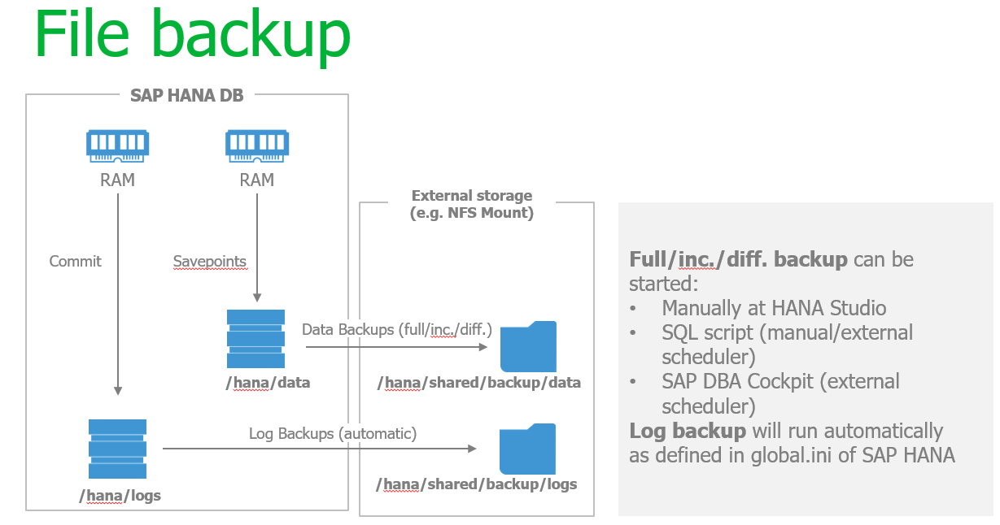 


## Backint API:

SAP HANA provides an option to use third-party backup tools to communication with SAP HANA database through Backint API for SAP HANA.

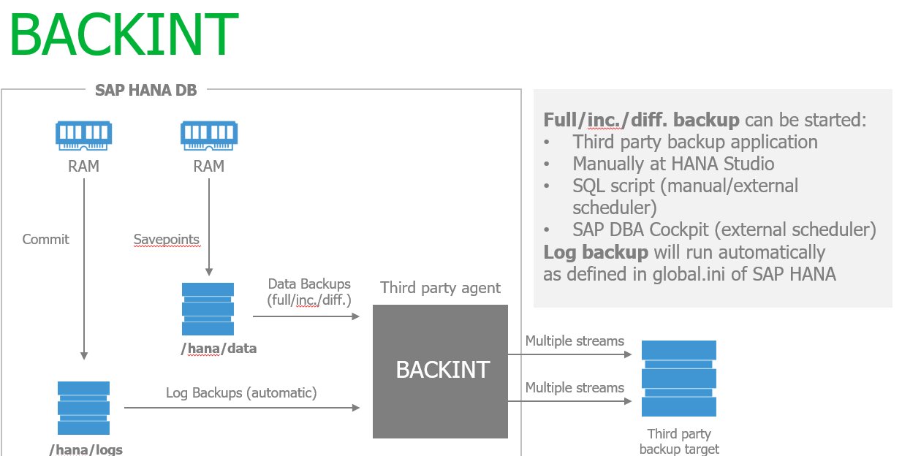 


## Storage Snapshot:

Storage snapshot allows to take backup of SAP HANA Database.

A storage snapshot created in three steps:

- PREPARE 
- CONFIRM
- ABANDON (* Only if there was an error in the creation of the snapshot *)

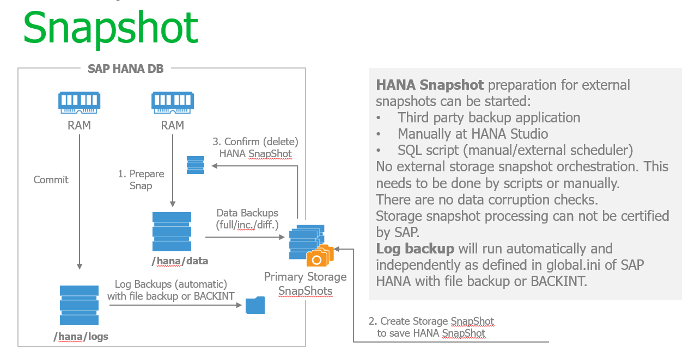 

*Note* 
>Snapshots are not part of the **Backint API specification**, and **currently no certification is required for 3rd party tools using HANA snapshots**


# Virtual Machine running SAP HANA Database Backup:

Veeam uses HANA database snapshot backup method by using Veeam guest processing [Pre & Post Thaw Scripts]( https://helpcenter.veeam.com/docs/backup/vsphere/backup_job_vss_scripts_vm.html?ver=95) 
Virtual HANA Backup with Agentless Image Level Backup:
Veeam Backup & Replication uses the scripts [Pre & Post Thaw Scripts]( https://helpcenter.veeam.com/docs/backup/vsphere/backup_job_vss_scripts_vm.html?ver=95) 
 which allow the execution of the backups via HANA Snapshot and also provide option to purge the transactions logs. 

The Pre & Post Thaw scripts can be download from [VeeamHub](https://github.com/VeeamHub/applications/tree/master/sap-hana)

## Configure Backup:

1. [Create Backup Job](https://helpcenter.veeam.com/docs/backup/vsphere/backup_job.html)
2. Select SAP HANA VM to Backup.
3. At the **Guest Processing step**, click **Applications**.
4. Click the **Scripts tab**.
5. In the **Linux Scripts** section, specify paths to **SAP HANA BACKUP [Pre-Freeze and Post-Thaw Scripts]
(https://helpcenter.veeam.com/docs/backup/vsphere/backup_job_vss_scripts_vm.html?ver=95)**.

## SAP HANA Backup Process: 

Please find below the process to backup Virtual Machine with SAP HANA DB:

1.	Veeam Backup Server execute the *HANA Pre-freeze Script* to prepare the internal snapshot of the SAP HANA database.
2.	Prepare Snap.
3.	The data will be synchronized and the pointers of the Transaction Logs and the internal SAP HANA backup catalog will be updated         to confirm the snapshot 
4.	Veeam will create Virtual Machine Snapshot.
5.	Veeam Backup Server execute the *HANA Post-Freeze Script*
6.	Removal of the HANA Snapshot to save system space
7.	Optionally Purge transation logs through the script.
8.	Data transfer to the Veeam repository. 

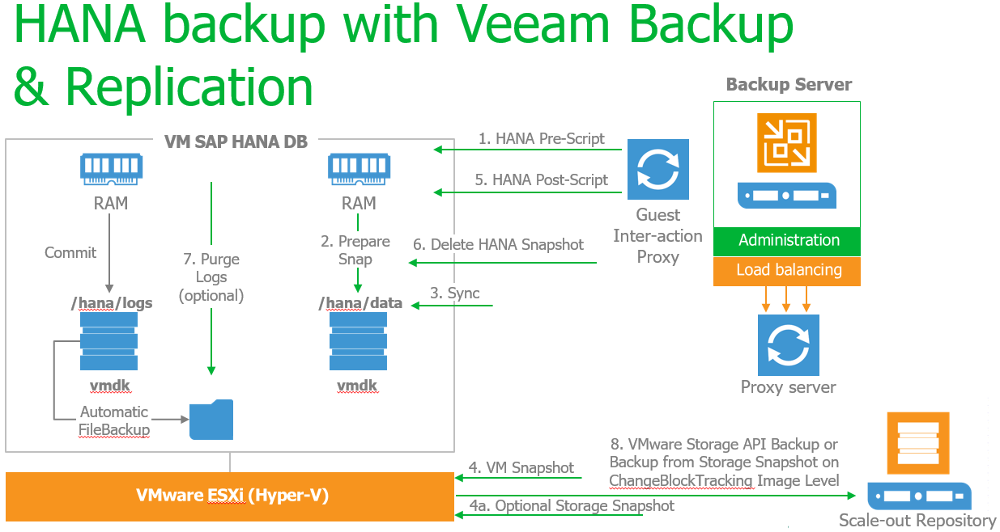

# SAP HANA Backup with Veeam Agent for Linux:

Similar to agentless virtual machine image based backup, Veeam Agent for Linux will uses the same [Pre & Post-Thaw Scripts] (https://helpcenter.veeam.com/docs/backup/vsphere/backup_job_vss_scripts_vm.html?ver=95) scripts. 

## Configure SAP HANA Physical Server Backup:

Install Veeam Agent for Linux to SAP HANA Physical Server, configure the [backup job] https://helpcenter.veeam.com/docs/agentforlinux/userguide/backup_job_create.html?ver=20 and use [script settings](https://helpcenter.veeam.com/docs/agentforlinux/userguide/backup_job_scripts.html?ver=20) select Snapshot scripts to configure [Pre Freeze & Post-Thaw Script](https://helpcenter.veeam.com/docs/backup/vsphere/backup_job_vss_scripts_vm.html?ver=95)

## SAP HANA Backup Process: 

Please find below process to backup Physical Server with SAP HANA DB:

1.	Veeam Agent execute the *HANA Pre-freeze Script* to prepare the internal snapshot of the SAP HANA database.
2.	Prepare Snap.
3.	The data will be synchronized and the pointers of the Transaction Logs and the internal SAP HANA backup catalog will be updated to confirm the snapshot 
4.	Veeam agent create the file system snapshot.
5.	Veeam Agent execute the *HANA Post-Freeze Script*
6.	Delete HANA Snapshot.
7.	Optionally Purge transation logs through the script.
8.	Veeam Change Block Tracking based Image Level Backup.

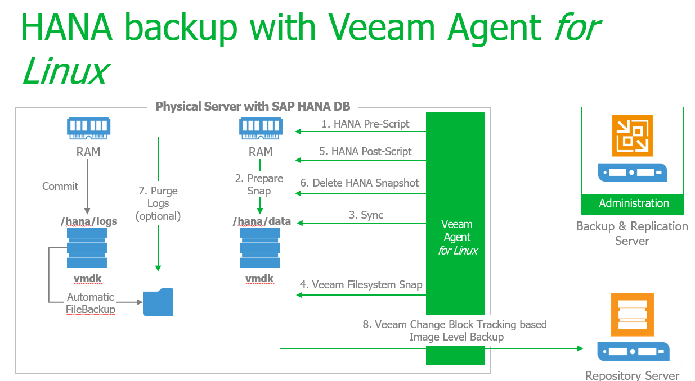

# Permissions:
For the standard username/password in the script user should have following privileges in SAP HANA environment:
•	Backup Admin.
•	Catalog Read. 
More about [user, roles and privileges] (https://help.sap.com/viewer/742945a940f240f4a2a0e39f93d3e2d4/2.0.01/en-US/45955420940c4e80a1379bc7270cead6.html) 
 
 # SAP HANA Pre-Freeze Script Configuration Options:

Starting with version 1.0 the script supports the use of an external config file. While it's still possible to manually set the username, password, keyprefix,purgelogs and purgedays options directly in the script, using a config file has the advantage that future updates to the script can be implmeneted without any changes to the file and the same exact script can be run on many different servers with the config options stored locally on each HANA server.

By default the script checks for the config file in the path /etc/veeam/hana.conf but this can be overridden with the -c parameter

### User & Secure User Store Authenticaiton:

The script can use standard username/password or Secure User Store Authentication Secure User Store requires a key for each instance which must be configured outside of this script using hdbuserstore executable (part of hdbclient install).

To use standard Username and Password set these, otherwise leave them empty
username=""
password=""

To use Secure User Store for SAP HANA authentication select a key prefix. This prefix will be combined with the instance number to reference a specific
key for authentication.  For example, the default prefix is HDB, so for HANA instance 00 the script will attempt to use key HDB00 to authenticate.

create Secure User Store use the following command syntax:
./hdbuserstore set <key> <host>:3<instance#>15 <user> <password>

For example, to create keys for instance 00 and 01 on host "hana01" using a username "VEEAM" and password "Backup123" run the following commands as the OS user that will be running the script to create their secure store:
./hdbuserstore set HDB00 hana01:30015 VEEAM Backup123
./hdbuserstore set HDB01 hana01:30115 VEEAM Backup123

## Additional configurable options:
usrsap=/usr/sap  Path to sapservices file/HANA install path
timeout=30       Maximum number of seconds to wait for snapshots to enter prepared state
keyprefix="HDB"


# SAP HANA Post-Thaw Script Configuration Options:

## User & Secure User Store:

To use standard Username and Password set these, otherwise leave them empty
```
username=""
password=""
```
To use Secure User Store for SAP HANA authentication select a key prefix.This prefix will be combined with the instance number to reference a specific
key for authentication.  For example, the default prefix is HDB, so for # instance 00 the script will attempt to use key HDB00 to authenticate.

To create Secure User Store use the following command syntax:
```./hdbuserstore set <key> <host>:3<instance#>15 <user> <password>```

For example, to create keys for instance 00 and 01 on host "hana01"

using a username "VEEAM" and password "Backup123" run the following commands as the OS user that will be running the script to create their secure store 
```./hdbuserstore set HDB00 hana01:30015 VEEAM Backup123```
```./hdbuserstore set HDB01 hana01:30115 VEEAM Backup123 ```

For HANA 2.0 SP1 and higher, which are always installed as multi-tenant databases even when a single tenant is in use, you must specify that the connection use the port of the SYSTEMDB as follows:

```./hdbuserstore set HDB00 hana01:30113@SYSTEMDB VEEAM Backup123```

For more information about keystore use please refer to the [SAP HANA documentation](http://documentation.commvault.com/commvault/v11/article?p=22335.htm)

### Additional configurable options
```usrsap=/usr/sap```  > Set to HANA install path
```keyprefix="HDB"```	
	
*Note* 
> Other than the above-mentioned parameters only if applicable script should not be modified unless a special configuration is required. 

## Verify Veeam HANA Backup via SAP HANA Studio:

You can verify the Veeam HANA Database backup from [SAP HANA Studio]( https://help.sap.com/viewer/a2a49126a5c546a9864aae22c05c3d0e/2.0.01/en-US) as shown in the figure below:
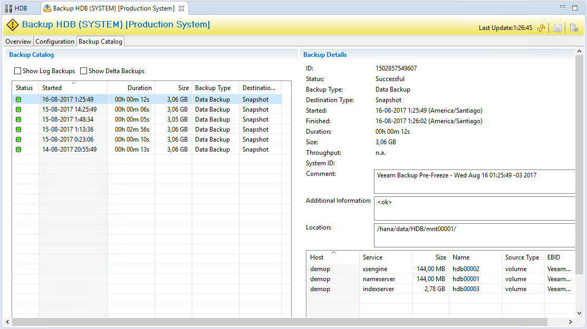

# Restore:

Restore is the integrated part of SAP HANA protection, Veeam provides various restore option to restore SAP HANA environment.

-	Virtual SAP HANA Restore.
-	Physical SAP HANA Restore.

## Virtual Machine running SAP HANA Database Restore:
Veeam provides following options to restore Virtual SAP HANA Environment:

-	Entire VM Restore (with Quick Rollback to restore only disk blocks with changes)
-	Instant VM Recovery.

## Entire VM Restore (Quick RollBack to restore only disk blocks with changes)

In event of database corruption or revert back the changes in the database, use the option to restore disk, below is the SAP HANA database restore process: Figure 1.0

1. The Virtual machine is turned off through the disk recovery of Veeam Backup & Replication. 
2. Recovery of the disk by enabling "Quick Rollback" in the recovery task. 
3. When you finish recovering only the blocks that have changed, the virtual machine is turned on. 
4. Open HANA Studio and select Restore Method including point in time Figure 1.1
5. HANA Studio will show the restored database point with a green point and will recover the database to it. Figure 1.2
6. HANA Will apply all log files to the point selected in the HANA studio restore wizard

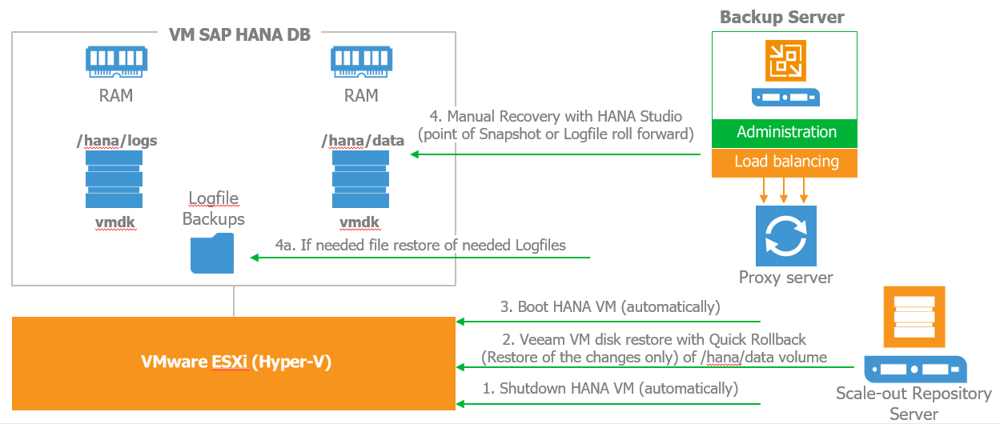


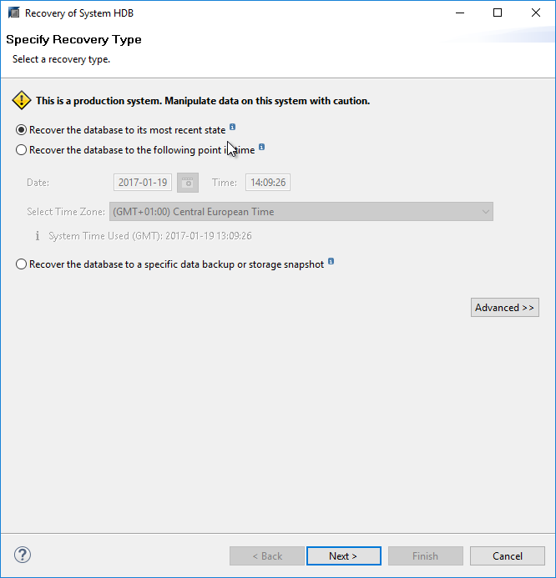 


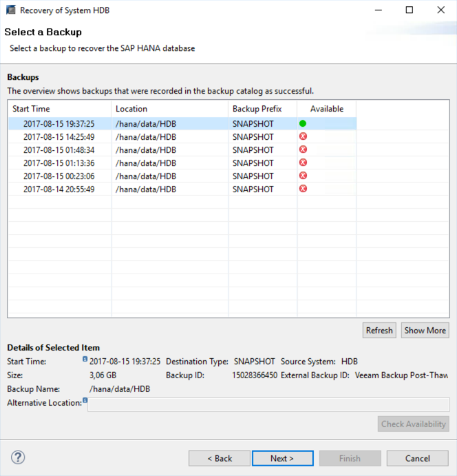 


## Instant VM Recovery

In the event of complete disaster, you can use [Instant VM Recovery]( https://helpcenter.veeam.com/docs/backup/vsphere/instant_recovery.html) to restore SAP HANA Virtual Machine in less than 15 mints SAP HANA will be able to provide services again**, below is the process to restore SAP HANA with [Instant VM Recovery]( https://helpcenter.veeam.com/docs/backup/vsphere/instant_recovery.html) See Figure 1.3

1.	Veeam through vPower NFS is presented as a repository on the host containing the virtual machine backup point. And turn on the virtual machine in the infrastructure.

2.	Data is then migrated online without affecting the SAP services directly to the production storage. Therefore, in less than 15 minutes SAP HANA will be able to provide services again in case of disaster.

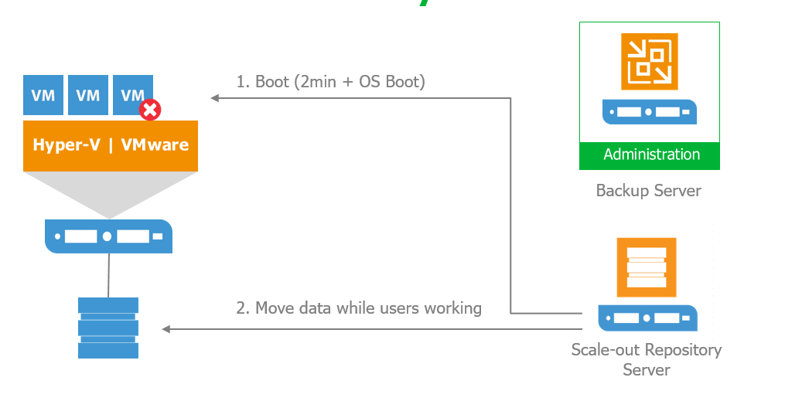 


## Physical Server running SAP HANA DB Restore.

Veeam provides following option to recover Physical Server running SAP HANA database:

-	[Recover Disk or Files]( https://helpcenter.veeam.com/docs/agentforlinux/userguide/baremetal_files_restore.html?ver=20) 
-	[Bare-Metal Recovery]( https://helpcenter.veeam.com/docs/agentforwindows/userguide/howto_baremetal_recovery.html?ver=21) 


## Restore Disk or Files:

Please follow the restore procedure explained in [Veeam Agent for Linux Guide]( https://helpcenter.veeam.com/docs/agentforlinux/userguide/baremetal_files_restore.html?ver=20) 

1.	Stop SAP HANA services 
2.	Recover disk volume, files or logs if necessary 
3.	Recovery process in SAP HANA Studio as explained in section Entire VM Restore.

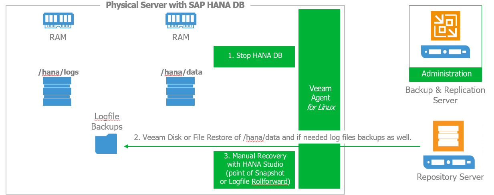

## Bare-Metal Restore:

Please follow the restore procedure explained in [Veeam Agent for Linux guide]( https://helpcenter.veeam.com/docs/agentforwindows/userguide/howto_baremetal_recovery.html?ver=21) 

