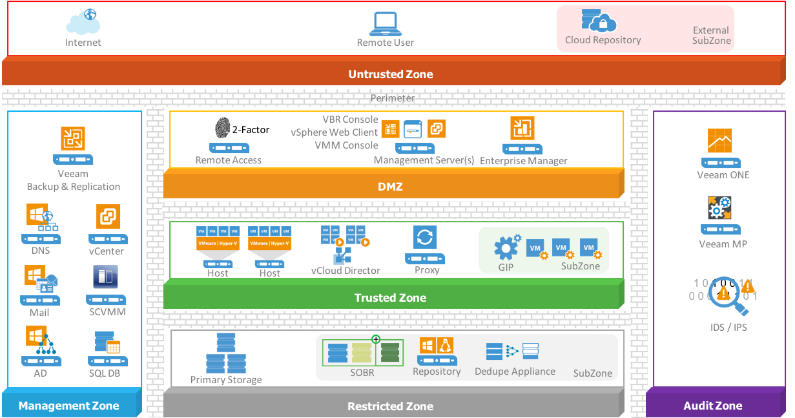

# Segmentation using Zones

Ultimately, all security is about protecting a valuable asset - in this case it is **Data** – but that protection involves a defence-in-depth strategy that includes all layers. To do a defence-in-depth, you should identify the most valuable data and build layers of defence around it to protect its availability, integrity and confidentiality.   

A zone is an area having a particular characteristic, purpose, use and/or subject to particular restrictions. By using zones, you have an effective strategy for reducing many types of risks. While securing your environment much granular and better, you will also lower costs associated with it. Instead of protecting everything with the same level of protection, you associate systems and information to specific zones. As a side effect, systems that are subject to regulatory compliance can be grouped in subzones to limit the scope of compliance checking and therefore, reduce costs and time needed to complete long-winded audit processes.

Think about the importance of the data and systems in that particular zone and who should have access to it. Communication is only allowed between systems in adjacent zones. A common data classification for a zone is about shared availability, confidentiality, integrity, access controls, audit, logging and monitoring requirements.

These common characteristics and requirements inherently lead to some level of isolation, but this isolation occurs not just between zones, but also within zones called subzones.

The attack surface of data and systems within a zone can be significantly reduced by exposing a limited number of services through the zone's perimeter and implementing strict access controls to limit access to specific groups of users. A potential attacker would have to gain access to all of the outer zones before getting to the restricted zone where the critical data is stored, reducing the likelihood of data theft or data mutilation. In addition, you are increasing the availability of these critical systems.

You could use a zone model as a strategic defence model which divides the different Veeam components into separate zones. Keep the following rules in mind while designing:
1.	Secure by Design
2.	Know what is important to secure and rank it
3.	Know your attack vectors and possible ways to secure them
4.	Use the principle of least privilege
5.	Have insight in costs and benefits

**Important:** Be aware that there is no silver bullet that will solve all your security needs at once! There are numerous ways to achieve your goal. Security is a state of mind and needs to be looked after every single day. If you think you are secure, because you followed all best practices you got a false sense of protection! Look at your organization needs and then choose the best way that fits your organization taking into consideration money (budget), risks (attack vectors) and possible outcome (how does it fit in, what would be the damage).

Implementing zones can be done in numerous ways depending on the approach you choose. But keep in mind that most of the threats nowadays are coming from the inside. Dividing your infrastructure into zones is a great way to provide better visibility into parts of greater importance. Without visibility it is sheer impossible to gain control and detect threats early. For hardening the Veeam Availability infrastructure components we place them in several logical zones.

One of the highest sought-after attack vector will be gaining access to management accounts and components. This will allow an attacker to gain access to most parts of the infrastructure instantly. While overlooking the major Veeam Backup & Replication components you will notice that there are three management components available.

The Veeam Backup & Replication Console also referred to as Console, the Veeam Backup & Replication Server which is the core component orchestrating all different jobs and ordering movement of data through the infrastructure and the Veeam Backup Enterprise Manager who federates multiple Backup Servers into a single pane of glass. Let’s place all major Veeam Availability components into the defined zones.

## Untrusted Zone
To keep a balance between security and operational efficiency you do not want to install the Veeam Backup & Replication Console on any system outside your organization infrastructure. But for operational efficiency you want to give your administrators the ability to connect to the infrastructure from any device and any location through remote access with only keyboard, mouse and video to their disposal.

For operational efficiency, you do not want to install Veeam Backup Console on machines on poor connections/long distance, there can be between 50-400 MB of data transferred between the console and backup repository when starting the console. If the first file mount is performed over a slow connection, it may take a considerable time to load the file-level recovery wizard. If there is significant latency between the backup repository and console, it is recommended to deploy an instance of the console on or closer to the repository server.

Deploy a firewall on the perimeter between the untrusted zone and the DMZ zone. On the firewall and/or dedicated RDS Gateway server add 2-factor authentication for remote administrators to access the RDS Gateway. Deny the mapping of drives, printers, clipboard etc. on the RDS Gateway to secure your infrastructure against dropping of content or files from any remote machine.

## DMZ
The DMZ houses systems that require exposure to the untrusted zone. This zone proxies access between systems in the DMZ and the Management Zone. Also, all traffic should be funneled through systems in the DMZ to reach Internet resources. The systems deployed in this zone should be tightly controlled and hardened to reduce attack surface.

The Veeam Backup & Replication console is a client-side component that provides access to the backup server. The console lets several backup operators and admins log in to Veeam Backup & Replication simultaneous and perform all kind of data protection and disaster recovery operations as if you work on the backup server.

Install the Veeam Backup & Replication console on a central management server that is positioned in the DMZ zone and make sure its protected with 2-factor authentication. You can also install other infrastructure tools on this management server like for instance the Microsoft VMM Console and/or VMware vSphere Client to manage your hypervisor deployment.

The Veeam Enterprise Manager will also be in the DMZ zone, because it serves as a Self-Service portal for specific user-groups in the organization.  

## Management Zone
In the management zone, you place infrastructure services like DNS, Active Directory and SMTP. But also, the VMware vCenter server and/or Microsoft System Center Virtual Machine Manager (SCVMM). From the Veeam components the Veeam Backup & Replication Server(s) will be in this Management zone. The Veeam Backup Server will orchestrate all jobs and update all Veeam components in the different zones from a central location.

The Microsoft SQL Database server, which is needed to host the Veeam Backup Database and the Veeam Enterprise Backup Database should be placed in this zone if it is dedicated just for Veeam. It is a good practice to use a dedicated SQL server which hosts the different SQL instances for infrastructure components and a different SQL server for SQL instances for business processes. The Veeam Backup & Replication server is a heavy user of the SQL server and by placing the SQL database server close by gains you operational efficiency.

The VMware vCloud Director is part of a subzone within the management zone and controls the vAPP’s running in subzones within the Trusted Zone.

The management zone requires secure and controlled access to the internet to download licenses and updates for different components in the infrastructure. It is highly recommended to use an Internet Proxy or Reverse Proxy situated in the DMZ as a controlled gateway to the internet.

All types of Cloud Repositories should be placed in subzones within the Untrusted zone. Organization data is leaving the security boundaries so make sure that, as an extra precaution, data towards these cloud repositories is encrypted during transport and when stored in the cloud repository. The Veeam Backup & Replication server will communicate with the Cloud Gateway service for transport of data to the Cloud Provider, Azure Proxy or AWS deployment.

## Trusted Zone
The trusted zone will be populated with hypervisor hosts like VMware ESXi and/or Microsoft Hyper-V hosts. All components in the Trusted zone will need access to different services in the Management zone. The Veeam Proxy servers, which are the data movers, are part of the trusted zone.

Veeam Proxies can back up the VMs without having access to the Guest OSes themselves. If you back up or replicate running VMs, you can enable guest processing options. Guest processing options are advanced tasks that require Veeam Backup & Replication to communicate with the VM guest OS. When VMs are separated in subzones you can deploy and leverage the Veeam Guest Interaction Proxy (GIP) in the Trusted Subzone, which will have secure access and deploys the needed runtime in the VM for guest processing tasks.

In the case that different business units or customers are running in the trusted zone you should think about running them in subzones of the trusted zone. But be aware that overly complex designs can be counterproductive and give a misplaced feeling of being safe.

VMware vCloud Director vAPP’s are also part of the Trusted Zone and would normally be divided in subzones per business unit or tenant. Veeam can capture whole vApps and vCloud Director configurations within the backup jobs.

## Restricted Zone
Primary storage, where production data and VM’s reside, but also other components which store data should be placed in this restricted zone. This zone should never be accessible by any user directly. Only available to the virtual infrastructure components and application servers and administrators with strict rights. Also, the Veeam Scale Out Backup Repository (SOBR), Simple Repository, Deduplication devices or Cloud Repository when used in combination with Veeam Cloud Connect for Enterprise (VCC-E) should be part of this zone. For organizations using VCC-E it is possible to define cloud repositories on top of their SOBR or as separate defined cloud repositories in a Restricted Zone subzone.

## Audit Zone 
Visibility is key to protect, detect and contain threats early. In this zone monitoring solutions like Veeam ONE and/or Veeam Management Pack in combination with Microsoft System Center are placed. Also IDS and IPS systems should be placed in this Audit zone.
