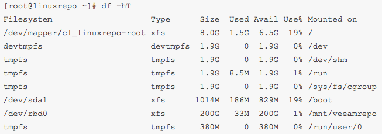
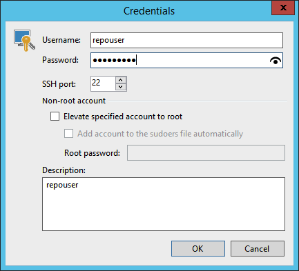
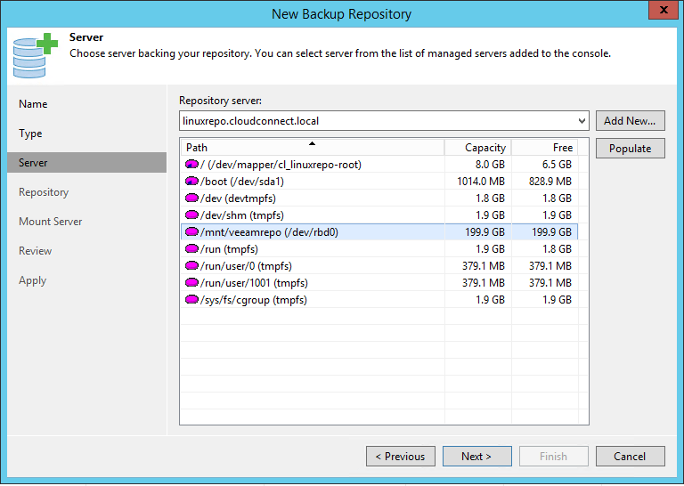
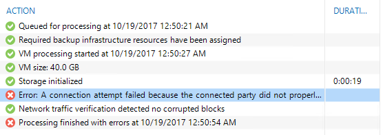
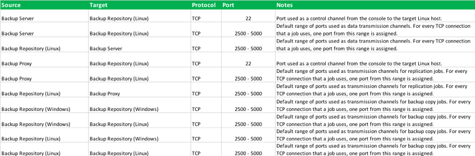

# Hardening Backup Repository - Linux

Veeam Backup & Replication, even if it’s mainly Windows based software, can also consume Linux servers as its backup repositories. The requirements are bash shell, SSH and Perl. Please check the full list of required Perl modules here: https://www.veeam.com/kb2216.

**Important:** 64-bit edition of Linux must be able to run 32-bit programs. Pure 64-bit Linux editions are not supported (Perl installation must support 32-bit variables).

Best Practices for Hardening Veeam Backup Repositories based on Linux are:
0. [K.I.S.S. design](./infrastructure_hardening.md/#secure-by-design) - Keep It Simple and Straightforward.
1. Make sure the servers are physical secured.
2. [Create a dedicated repository account](#create-a-dedicated-repository-account) for Veeam, that can access the folder where you store backups.
3. [Set permissions on the repository directory](#set-permissions-on-the-repository-directory) to only that account.
4. You do not need Root to use a Veeam Linux Repository. Also do not use SUDO.
5. [Modify the Firewall](#modify-the-firewall), with dedicated rules for Veeam to allow access to specific ports.
6. Use [Veeam encryption](#use-veeam-encryption) while storing backups on the repository.

** Note:** In the example below CentOS is used as linux distribution, please adapt the different commands to your own distribution if needed.

## Create a Dedicated Repository Account

Veeam only needs a regular user that has sufficient permissions to the folder where you want to store backups. Not even sudo is required. Besides, it is generally not considered best practice to provide sudo access to accounts used for Linux repositories. Far better is to create a restricted user and set the permissions on the repository directory to only that user.

Actually, the only real reason Veeam may need a root account at all is to initially modify sudoers, but if people are willing to add the Veeam user account to sudoers manually (or via some configuration management) then we don’t need a root account as we’ll just use a regular account and sudo when required for things like file restore.

CentOS allows to create a new regular user directly during the installation process:

Let’s say we didn’t create any user yet, so we only have the root account in this machine. We first create a new dedicated user for our backups:

`useradd -d /home/repouser -m repouser`

`passwd repouser`

## Set Permissions on the Repository Directory
In this new Veeam Linux Repository we mounted a new backup volume as `/mnt/veeamrepo` with 200GB of free space.

Let's set the folder permissions so the newly created user is only allowed access to this folder `/mnt/veeamrepo`

`chown repouser.repouser veeamrepo/`

`chmod 700 veeamrepo`

With these commands we changed the ownership of the folder to the user `repouser`, and we gave full permissions to this user only, over the folder. Only this user has `rwx` permissions.  All other accounts would be denied access.

## Configure the Linux Repository in Veeam

Open the Veeam Backup & Replication console and add a Linux Repository. At the credentials step, register the username you created before, with its password:

**Note:** Before you can populate the list of available folders, remember you need to have the required Perl modules installed.

If the software prerequisites are all satisfied, you will see the volume among the available ones:

Select the volume and complete the wizard and have your Linux repository ready to be used.

## Modify the Firewall

Before starting any backup, there’s one more thing you need to configure: just because you were able to connect through ssh, you may think that the Linux firewall is not enabled, but in reality, it is enabled. So, if you just try to run a backup, at the _initializing storage_ step, you will get an error:

The error says, _A connection attempt failed because the connected party did not properly respond after a period of time, or established connection failed because connected host has failed to respond 10.10.51.51:2500_. This error says that the proxy tried to connect to the repository over port 2500 (one of the dynamic RPC ports Veeam uses) but this port was not reachable. This is because the firewall is still up and running.

You can test if the firewall was enabled by running these two commands:

`systemctl disable firewalld`

`systemctl stop firewalld`

Run the backup again and if it did not fail this time you know that you have to create some dedicated rules for Veeam in the firewall.

Rules that need to be added are:

## Use Veeam Encryption

Regarding keeping root out of the backup folder on the Linux Repository, there is really no practical way to do this. Some would say you can create a SElinux/Apparmor policy, but, the problem is, the user that is root can almost certainly reboot the system with these policies disabled and/or change these policies.

Otherwise, in every other scenario like the one described, root can access the folder as much as the dedicated user. The normal way in the Linux world is, if you want to protect your files from root, would be to use per-user encryption. This is why many Linux distributions ask you to setup home directory encryption during install. The root user can still access the files, but all of the data is encrypted and cannot be read without the passphrase. Veeam recommends using [Veeam encryption](./infrastructure_hardening.md/#encryption) for this use case to provide the same level of protection.
