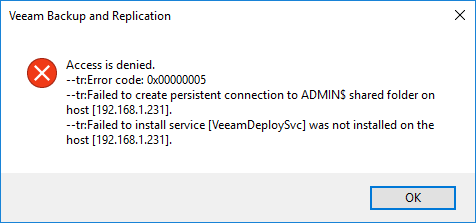
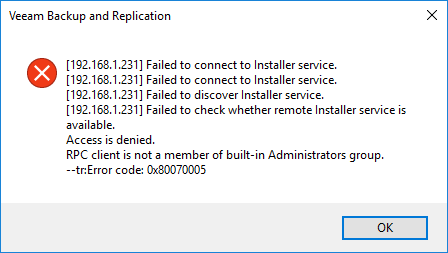
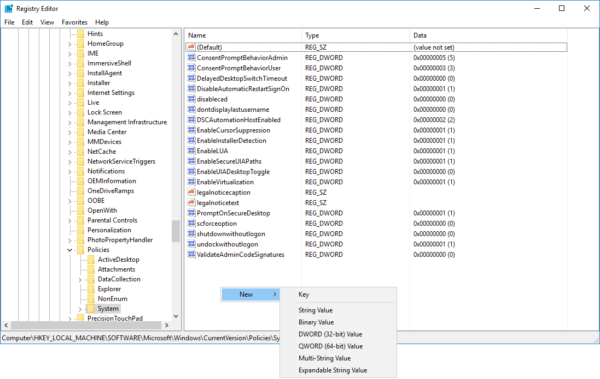
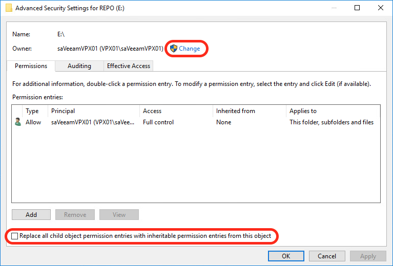
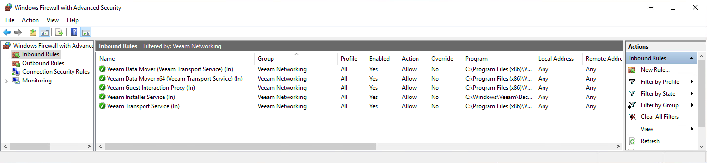

# Hardening Backup Repository - Windows

A good way of hardening the backup repository is by running it on a standalone Windows Server with storage attached to it. Create/Use a local account with administrative access and make sure only this (newly created) account has access rights to the location where the backup files are being stored. Veeam needs a local account with administrative access to function properly.

Best Practices for Hardening Veeam Backup Repositories based on Windows are:

0. [K.I.S.S. design](./infrastructure_hardening.md/#secure-by-design) - Keep It Simple and Straightforward.
1. Use a [standalone Windows Server](#standalone-and-physical-secured) which is not part of any Active Directory Domain.
2. Make sure the repository servers are [physical secured](#standalone-and-physical-secured).
3. [Use a local account with administrative access](#local-account-with-administrative-access)
4. [Set permissions on the repository directory](#set-permissions-on-the-repository-directory) to only that local account.
5. [Modify the Firewall](#modify-the-firewall), with dedicated rules for Veeam to allow access to specific ports.
6. [Disable remote RDP services](#disable-remote-rdp-services) to the repository servers.
7. Use [Veeam encryption](./infrastructure_hardening.md/#encryption) while storing backups on the repository.

## Standalone and Physical secured
When protecting the whole environment you do not want the Veeam repository to be tied to the same Windows Active Directory domain you are protecting with the backup. Otherwise if everything is lost you could have a chicken and egg problem around accounts wanting to authenticate against a domain  which is no longer available.

Furthermore if a Domain Admin account is compromised you do not want that account to be able to overrule a backup repository account password so the hacker gets access to the backup files together with access to the whole environment.

Place the repository servers in a Restricted Zone, because these servers contain a 100% copy of your production environment! The repository servers should be physical secured, and have appropriate access control systems in place. This way access is restricted, who does have access is registered and monitored at certain specified levels.

## Local Account with administrative access

The easiest and best way to leverage a local account with administrative access to the repository server is by using the builtin Local Administrator account. As an extra precaution make sure you rename the account so a potential hacker has to guess the account name **_and_** the password. By using local Account specific per Veeam Backup Repository server you increase the level of protection. In the event that one of those accounts get compromised the other repository servers stay secure.

When your organisation does **_not allow_** you (e.g. global security policy) to use the builtin local administrator account, you can create a new local account and give it administrative access. Make sure the Local Administrator account is highly secure in this case.

**Note:** UAC affects connections for nondomain/local user accounts. If you connect to a remote computer using a nondomain/local user account included in the local Administrators group of the remote computer, then you must explicitly grant remote DCOM access, activation, and launch rights to the account. User Account Control (UAC) access-token filtering can affect which operations are allowed or what data is returned. Under UAC, all accounts in the local Administrators group run with a standard user access token, also known as UAC access-token filtering. An administrator account can run a script with an elevated privilege "Run as Administrator". Some securable objects may not allow a standard user to perform tasks and offer no means to alter the default security. In this case, you may need to disable UAC so that the local user account is not filtered and instead becomes a full administrator. One important thing to know is that UAC is not a security boundary. UAC helps people be more secure, but it is not a cure all. UAC helps most by being the prompt before software is installed. This part of UAC is in full force when the “Notify me only when…” setting is used. UAC also prompts for other system wide changes that require administrator privileges which, considered in the abstract, would seem to be an effective counter-measure to malware after it is running, but the practical experience is that its effect is limited. For example, clever malware will avoid operations that require elevation. Be aware that for security reasons, **_disabling UAC should be a last resort_**.

The downside of creating a newly administrative local account is that you will need to disable Remote User Account Control (UAC) because this Windows function prevents local accounts from running in an elevated mode when connecting from the network. Veeam accesses the ADMIN$ and C$ through the Installer Service with the local account you presented while adding the Windows server to Infrastructure in Veeam Backup & Replication.

The connection will fail with the following error message: _Access is denied –tr:Error code: 0x00000005[^1] –tr:Failed to create persistent connection to ADMIN$ shared folder on host [host name or ip-address] –tr:Failed to install service [VeeamDeploySvc] was not installed on the host [host name or ip-address] when Remote UAC is Enabled on the Windows Server._

or with the error message: _RPC Client is not a member of built-in Administrators group. –tr:Error code: 0x80070005 when the server was already added as a Veeam Backup Repository through Infrastructure within Veeam Backup & Replication._

The Veeam Installer service pushes the Veeam binaries through the ADMIN$ and C$ share on the target machine. It also uses administrative shares later on for other jobs.

You can disable Remote UAC on the repository server by using `REGEDT32` to navigate to the following registry path:

`HKEY_LOCAL_MACHINE\SOFTWARE\Microsoft\Windows\CurrentVersion\Policies\System`

Add a new Key with type `DWORD (32-bit)` Value and name it `LocalAccountTokenFilterPolicy` give it a value of `1`. No restart is needed.

## Set permissions on the repository directory

Login with the newly created local account or with the renamed local administrator and open File Explorer, locate the disk(s) where the backup files will be placed (or are already there in an existing deployment). Open the properties of the disk and Add the used account and give it Full access. Tick all Allow boxes.

Remove all accounts except the SYSTEM and the account you are using.

**Important:** the SYSTEM group account can also be removed, **_but_** then the Veeam services need to start with the local administrative account used instead of Local System otherwise the backups will fail. Keep the KISS principle in mind here.

After adding the used administrative account on the security tab of the disk(s) where backups will reside. Open the advanced security settings and Change the Owner. When there are already backup files on this disk make sure to tick the box: _Replace all child objects permissions entries with inheritable permissions entries from this object_.

## Modify the Firewall

You have three options to make the first install of Veeam components, pushed from the Veeam Backup & Replication server, a success. From most preferred to least preferred option:  

1. Keep Windows Firewall On and add three new firewall rules.
2. Keep Windows Firewall On and manual install the Veeam Installer Service (VeeamDeploySvc)
3. Switch Windows Firewall Off and enable File and Printer Sharing during the first install

**Option 1** - Windows Firewall On and add three new firewall rules
From a command prompt run the following three commands to add three new rules to the Windows Firewall:

`netsh advfirewall firewall add rule name="Veeam (DCOM-in)" dir=in action=allow protocol=TCP LocalPort=135 enable=yes program="%systemroot%\system32\svchost.exe" service=RPCSS remoteip=<VBR Server IP-address>`

`netsh advfirewall firewall add rule name="Veeam (SMB-in)" dir=in action=allow protocol=TCP LocalPort=445 enable=yes program=”System" remoteip=<VBR Server IP-address>`

`netsh advfirewall firewall add rule name="Veeam (WMI-in)" dir=in action=allow protocol=TCP LocalPort=RPC enable=yes program="%systemroot%\system32\svchost.exe" service=winmgmt remoteip=<VBR Server IP-address>`

After adding these firewall rules nothing else has to be done to the Windows server to be added to the Veeam Infrastructure components. You also do not have to switch on File and Printer Sharing specifically.

**Tip:** You can also store these three commands in a windows bat file and run that on every Windows server you are preparing to use as a Veeam Infrastructure component.

**Option 2** - Windows Firewall On and manual install of Veeam Deployment Service
Open the `CMD` utility on the repository server and create a folder C:\Windows\Veeam\Backup

`mkdir C:\Windows\Veeam\Backup`

Copy two files named: `VeeamDeploymentDll.dll` & `VeeamDeploymentSvc.exe` from the Veeam Backup & Repository server path C:\Program Files\Veeam\Backup and Replication\Backup\Packages

**Tip:** Use `TAB` key for auto completion.

Run on the Veeam repository server in the directory C:\Windows\Veeam\Backup through `CMD` the following command: `VeeamDeploymentSvc.exe -install` this way the Veeam installer service will be installed. Veeam will add Firewall rules for Veeam during installation, which are visible as _Veeam Networking_ in the firewall under Allowed apps and features.

**Tip:** this manual install process can be interesting for so called 'Dark Sites'. With the command: `VeeamDeploymentSvc.exe -uninstall` you can remove the installation services.

**Option 3** - Windows Firewall Off and enable File and Printer Sharing
Disable the Windows Firewall for the Private Networks during the initial Veeam installation. This way the right binaries gets pushed to the Windows repository server. Veeam will add Firewall rules for Veeam during installation, which are visible as _Veeam Networking_ in the firewall under Allowed apps and features. After the process completed successful make sure you enable the Windows Firewall again!

## Disable remote RDP services
Veeam Backup Repositories are (most) often physical. An extra security measure is to disable any remote RDP access in Windows and use a KVM-over-IP switch to access this machine remotely in the datacenter.

[^1]: Error code 0x00000005 refers to Remote UAC and local administrative account but not the original local administrator, code 0x00000040 refers to Server service stopped/crashed no administrative shares available, 0x00000057 multiple same usernames in Veeam credentials manager with different passwords
