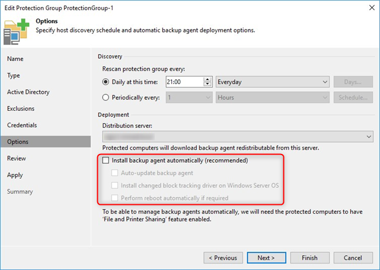
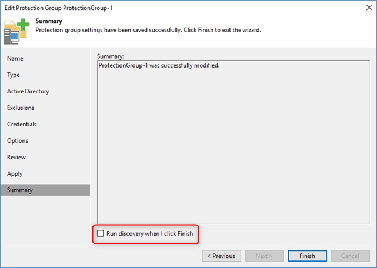
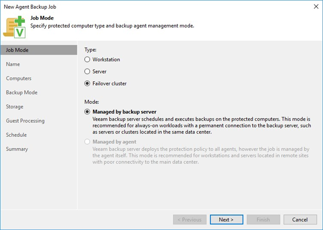

# Agent Management

Veeam Agents provide the ability to backup and restore physical workloads and starting from version 9.5 Update 3, Veeam Backup & Replication lets you centrally deploy and manage *Veeam Agent for Microsoft Windows* and *Veeam Agent for Linux* on computers in your infrastructure from within the Veeam Backup & Replication console.

The central management of Veeam Agents involves additional elements in the console:

- **Protection Group** - Container in the Veeam Backup & Replication inventory aimed to combine protected computers (e.g. by type or workload etc.)
- **Agent Backup Job** - Runs on the backup server in the similar way as a regular job for VM data backup. One job can be used to process one or more Protection Groups and/or individual computers.
- **Backup Policy** - Describes configuration of individual Veeam Agent backup jobs running on protected computers (in contrast to Agent Backup Jobs running on the backup server). Settings from a Backup Policy can be applied to one or more individual computers or computers added to the inventory as part of a Protection Group.

For detailed descriptions of the purpose, setup, usage and behavior of these elements please refer to the [Veeam Agent Management Guide].

## Agent for Windows Types
Veeam Agent for Windows is available in two different versions, depending on the way how the agent's backup is managed: A lightweight version and a full version.

The leightweight version does not include a local database or any GUI elements so it cannot be managed on the local agent computer. The full version utilizes a local *Microsoft SQL Server 2012 Express LocalDB Edition* (automatically installed) and installs a set of applications with local user interfaces for creating and managing backup and restore jobs. However, these user interfaces become restricted (i.e. most settings cannot be changed locally) as soon as the agent is under control of a backup policy of a Backup & Replication server (i.e. the agent computer belongs to a Protection Group which is assigned to a backup job in _"managed by agent"_ mode). Details about system requirements and components installed as part of the Veeam Agent package can be found in the [Veeam Agent Management Guide].

 The following table shows the relationships between agent types and management scenarios.

| Management Scenario | Full Backup Agent | Lightweight Agent |
| --- | :---: | :---: |
| **Standalone mode** (manual install, no VBR server) | X |  |
| **Distributed and managed by Backup Server** |  |  |
| Backup job mode: Managed by backup server |  | X |
| Backup job mode: Managed by agent (= Backup Policy) | X |  |

## Protection Groups
The purpose of Protection Groups within Veeam Backup & Replication is to specify computers on which Veeam Agents should be installed and managed. The selection of computers within a particular Protection Group can be based either on individual IP addresses, Microsoft Active Directory objects (entire domain, container, organizational unit, group, computer or cluster) or computers listed in a CSV file. Each Protection Group requires a unique name for display under the "Physical & Cloud Infrastructure" node on the Inventory page of the Backup & Replication console. Additionally, there are predefined Protection Groups (manually added, unmanaged, out of date, offline, untrusted). For details please refer to the [Veeam Agent Management Guide].

### Discovery / Rescan
Within each manually created Protection Group there are two configuration options within the Protection Group's configuration dialog that should be reviewed carefully: 

- Checkbox: Install backup agent automatically (plus sub-options on the "Options" page of the dialog)

- Checkbox: Run discovery when I click Finish (on the "Summary" page of the dialog)

Both checkboxes are ticked by default which leads to the installation of Veeam Agent components on the computers targeted by the Protection Group as soon as the wizard dialog is closed by clicking the Finish button. This is due to the fact that a rescan job is started directly after finishing the dialog and the "Run discovery" checkbox was ticked. This job updates the Protection Group's member list based on the chosen method and then connects to each computer in the list to deploy the Veeam Installation Service on each newly discovered computer. Then, based on the "Install backup agent automatically" setting and its sub-options, additional software components will be installed on the targeted computers.

In enterprise-grade environments with usually very strict software deployment/maintenance rules and processes, it is very likely that an automatic installation of software components on a number of computers does not comply to such regulations when executed this way.

As a best practice it is recommended to carefully review and uncheck these options as needed whenever the Protection Group configuration is committed by clicking the "Finish" button. It might also be desirable to disable the recurring, scheduled rescan of Protection Groups as described [here][Disable Protection Group].

## Agent Support for Microsoft Failover Clusters
Veeam Agent for Windows supports backup and restore of Microsoft Failover Clusters which can be targeted by selecting the type "Failover cluster" on the "Job Mode" page of the agent backup job configuration dialog.

As shown in the screenshot above, a backup job of type "Failover cluster" cannot be configured to be "Managed by agent". This is due to the fact that only the lightweight agent version is supported on failover clusters. Additionally, a Protection Group assigned to a backup job of type "Failover cluster" must be of type "Active Directory objects" and the desired cluster object from Active Directory needs to be added to it, either directly or via an object which contains the cluster object (i.e. group or organizational unit). This also allows processing of more than one failover cluster in a single backup job.

For further requirements, limitations, supported cluster configurations and -workloads see the [Cluster Support Section][Cluster-Support] of the Agent Management Guide.

### Backup Processing of Cluster Disks
When an Agent backup job targeting a failover cluster is executed, all cluster nodes are processed in parallel (with respect to the concurrency settings configured for the proxy and repository servers involved). However, if one node owns more than one cluster disk at the time of the backup run, the cluster disks owned by this node will be backed up in sequence. On the repository server, each cluster node consumes one task slot during backup processing.

>**Note**: If the owner of a cluster disk changes while the disk is in the process of being backed up, the corresponding backup job will fail.

<!-- referenced links -->
[Veeam Agent Management Guide]: https://helpcenter.veeam.com/docs/backup/agents/index.html

[Cluster-Support]: https://helpcenter.veeam.com/docs/backup/agents/index.htmlcluster_support.html

[Disable Protection Group]: https://helpcenter.veeam.com/docs/backup/agents/index.htmlprotection_group_disable.html

[Sizing Summary]: ../resource_planning/Appendix_A_Sizing.md