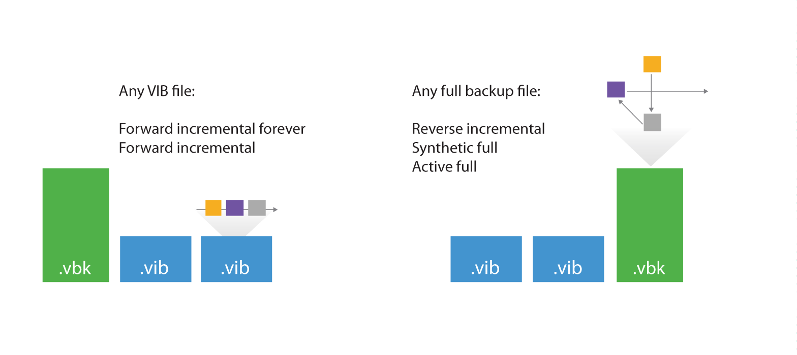

<!--- This was last Changed 03-05-17 by PS --->
### Comparing Direct Mode with WAN Accelerated Mode

Consider that the savings rate (18.5x) displayed in the GUI is based on **Processed** data ("re-hydrated" data blocks). In the example above, 283 MB would have been transferred over the WAN link in Direct Transfer mode, while only 72.8 MB were transferred after enabling WAN acceleration. The actual savings rate equals 3.9x in this relatively static demo infrastructure, whilst it would typically be significantly higher in real-life scenarios.

**Note**: Approximate savings ratio can be assumed as of 10x.

To calculate possible savings and needed bandwidth you may use the following calculator [Bandwidth Calculator](http://vee.am/bandwidth).

## Backup Mode Effect

When planning for WAN acceleration, review the backup mode used on the primary backup job. Some backup methods produce a random I/O workload on the source repository (as opposed to sequential I/O patterns in other backup modes). The methods of reading from source is illustrated by the figure below:

 

For example, forward incremental and forever forward incremental methods will make backup copy jobs work much faster, as read operations will be sequential rather than random. To avoid similar fragmentation and random I/O on forward incremental modes, keep [backup storage maintenance](../job_configuration/backup_job.md#storage-maintenance) enabled when possible.

Though a workload penalty may not be significant, it can be a good idea to monitor the storage latency on the backup repository, especially if the reported bottleneck is *Source*. If the storage latency on the
backup repository is high, it is recommended that you change the backup mode in order to increase the throughput of one pair of WAN accelerators.

## Configuration

_Thanks to our friends at PernixData for helping with I/O analysis using [PernixData Architect](https://www.pernixdata.com/pernixdata-architect-software)._

When configuring the WAN accelerator, not all configuration parameters affect both source and target WAN accelerators. In this section we will highlight what settings should be considered on each side.

### Source WAN Accelerator

At the first step of the WAN accelerator configuration wizard, you can change the default setting of five TCP threads. This setting applies to
the source WAN accelerator only and is automatically configured to mirror the number on the target WAN accelerator at the beginning of each job. This ensures different source
WAN accelerators can have different settings when using the same target WAN accelerator at different times. The maximum setting is 100 simultaneous threads for throughput optimization and compensation for high latency or packet loss.

If the link has low latency and high bandwidth, the default setting (5 streams) may be enough to fully saturate it. If the link is still not saturated,
the number of streams may be increased accordingly.

Testing shows that with high latency links, _**link speed x 1.5**_ is a good best practice for estimating the number of streams required. Below is an example
benchmark on a 10 Mbit/s WAN link with 100 milliseconds of latency.

| Link (Mbit/s) | Latency (ms) | Packet loss (%) | Streams | Throughput (Mbps) |
|:--------------|:-------------|:----------------|:--------|:------------------|
| 10            | 100          | 0               | 3       | 3.5               |
| 10            | 100          | 0               | 10      | 7.5               |
| **10**        | **100**      | **0**           | **15**  | **10**            |
| 10            | 100          | 0               | 20      | 10                |

Increasing the number of streams to more than required for fully saturating the link will cause initialization of data transfers to slow down, as the data transfer will wait for all streams to initialize and stabilize before beginning transferring any data.

**Tip:** To test different scenarios in the lab before deploying WAN acceleration, you can use a WAN emulator (such as [WANem](http://wanem.sourceforge.net/)).

When configuring the cache location for the source WAN accelerator, consider that the actual cache size on the source is irrelevant, as it is used only for digest files (where block hashes are stored). However, if a WAN accelerator will be used for bi-directional acceleration (act as both source and target), follow the guidelines provided in the "[Target WAN Accelerator](#target-wan-accelerator)" section below.
