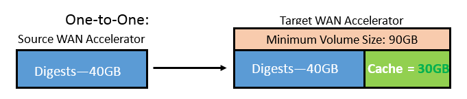
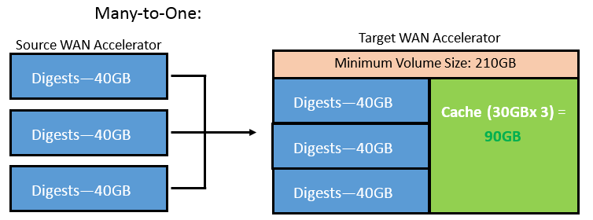

<!--- This was last Changed 03-05-17 by PS --->
## Sizing Targets for One to One and One to Many relationships

**WAN Accelerator Cache/Digest Provisioning**

we can have two types of relationship with our Source and Target accelerators, One to One and many to One.

**One to one is the most simplest form**, this is where one Source Accelerator is mapped to a single Target Accelerator at the other location.

The other type is **Many to One** where many source accelerators will map to a single target accelerator in a **fan in** type design. this is a common configuration and best practice is to have no more than 4 source accelerators to a single target for resource reasons.

##### Sizing for each scenario:

If we assume that we have 3 VMs, each with unique OSes (for instance, Win 2008R2, Win 2012R2, Solaris 10) each OS requires 10GB to be allocated for it.

The Cache itself is wholly independent from the digests required. That is, the Veeam GUI does not make any determination of how much you can allocate for a digest and so on.

The digest is essentially an index of what cached blocks go where. For digest size, 1TB of 
VM disk capacity we are backing up should correspond with 20GB of disk space. That is, for 10VMs we are backing up whose capacity is 2TB, you must account/allocate 40GB for digest data on the Source WAN Accelerator. This limitation is not applied to the Target WAN Accelerator.

For a Many-to-1 setup, the global cache is calculated per 1 Source WAN Accelerator working with the Target WAN Accelerator.

In this case the global cache needs to be increased proportionally.

If we use the same VMs in the previous example, the cache is only required to be 30GB. However, since we’re using 3 Source WAN Accelerators, the cache size must be 90GB in response.  

On the Target WAN Accelerator, cache size is dictated by the amount of Source WAN Accelerators plus number of operating systems in use, the digests space on the target end in this example cannot be excluded from the calculation even though it may never be used. We may require 120GB of Digest space at source so this needs to be added to the cache size (90GB) at target resulting in a requirement of 210GB of capacity at a minimum on the target.

**When creating a WAN Accelerator in the user interface it relates to cache sizing only, digest sizing should be part of the overall design and included as part of the specification of the WAN Acceleration host.**

**Note:** The target accelerator will use the digest capacity in the event the source digest becomes unavailable, is rebuilt or becomes corrupt. The target will use the spare capacity to calculate the digests on the target.
