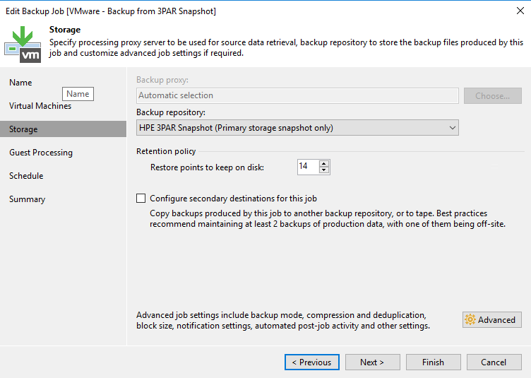
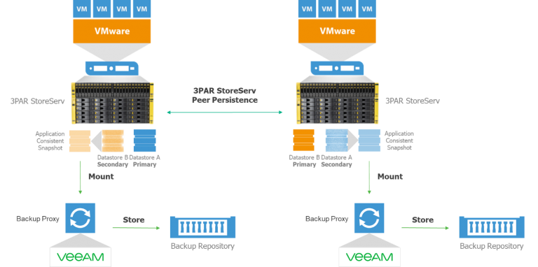

# HP 3PAR

Specifically for HP 3PAR 

##Enabling HPE 3PAR Web Services API Server

This step must be performed if you plan to work with the HPE 3PAR StoreServ storage system.

To check if the HPE 3PAR Web Services API server is enabled and enable it if needed:

Log on to the Processor with administrator privileges:
#ssh <administrator account>@<SP IP Address>

View the current state of the Web Services API Server:

#showwsapi
-- -State- -HTTP_State-
HTTP_Port -HTTPS_State- HTTPS_Port -Version-
Enabled   Active Enabled       8008
Enabled       8080         1.1

If the Web Services API Server is disabled, start it:

#startwsapi

If the HTTP or HTTPS state is disabled, enable one of them:

#setwsapi -http enable

or

#setwsapi -https enable

## Snapshot Only

For HPE 3PAR systems Veeam offers a SnapShot Orchestration
only feature. SnapShot orchestration means to use storage SnapShots as
backup target. The feature can be used without any need to run a real
backup to an external repository. Veeam is taking care of all required
storage related tasks like data retention, SnapShot management.

The workflow for Storage Orchestration is:

1.  _(Optional)_ Application-aware processing ensures transactional consistency
    within the VM
2.  Veeam requests a VM snapshot via VADP
3.  Immediately after creating the VM snapshot, a storage snapshot
    request is issued for saving the VM *including* the application
    consistent VM snapshot within the storage snapshot.
4.  When the storage snapshot has been created, the VM snapshot is
    deleted

To configure a “SnapShot only” job set the Repository to "HPE 3PAR SNAPSHOT (Primary storage snapshot only)"

The retention policy defines the number of storage snapshots to keep.
To store 5 snapshots a day for 1 week, configure the retention to 35 restore
points with a daily schedule. If the job is configured with a high or lower
schedule frequency, adjust the number of restore points accordingly.

When using Snapshot Orchestration please take care of the retry
scheduler setting.

If you have for example 100 VMs in one job and 10 of these VMs are
failing in the first run Veeam will rerun the job based on the retry
settings. If the setting is set to 3 (default) Veeam will try 3 more
time to process the failed VMs. For every successful retry Veeam will
create a new Snapshot. If all retries are needed to proceed the failed
VMs that ends in 3 Snapshots for one run. It is recommended to not set
the value higher than 3 or disable the automatic retry to avoid a high
number of Snapshots being created during every run.

One of the big benefits is that you are still able to use all Veeam
restore capabilities from storage snapshots. For more please refer to
the [Veeam Explorer for Storage Snapshots](./veeam_explorers.md#explorer-for-storage-snapshots) section.

## Backup from HPE 3PAR StoreServ secondary storage array

With HPE 3PAR StoreServ, the main requirement is that a Peer Persistence relationship is configured between the two arrays. This allows volumes to maintain a synchronous copy of themselves on the other array, which is the main difference compared to other storage systems. The replicated volumes are exported in a read-only mode and thus act as passive volumes. In such a configuration, both arrays are active and hold primary production volumes and secondary volumes. Note that we can back up or replicate VM data from both arrays

When Veeam Backup & Replication is configured to use snapshots of secondary volumes, the storage snapshot is triggered directly on the secondary volume, which means that the primary one remains untouched from a backup activity perspective.

## Configuring Veeam Backup & Replication

Unlike many other features, this one isn’t configured in the GUI as it is usually. Enabling it is controlled through the Windows Registry on the machine hosting the Veeam Backup Server role. A new registry key needs to be created using the following parameters:

Location: HKEY_LOCAL_MACHINE\SOFTWARE\Veeam\Veeam Backup and Replication\
Name: Hp3PARPeerPersistentUseSecondary
Type: REG_DWORD (0 False, 1 True)
Default value: 0 (disabled)
To enable the feature, the value must be set to 1. For the new setting to be effective, you need to restart the Veeam Backup Service manually.
