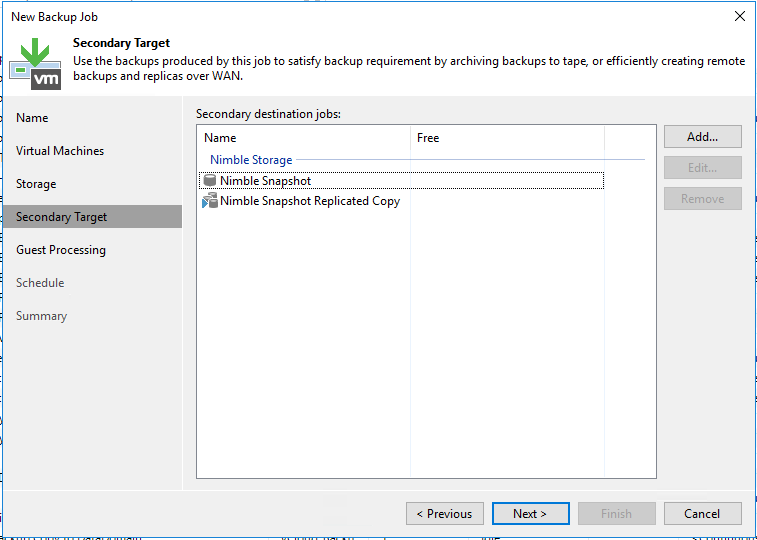
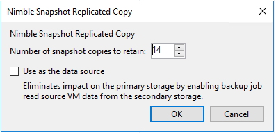

# Nimble Storage

This section contains integration specific information for configuring
orchestration of snapshot creation and replication between Nimble Storage arrays.

## Storage array configuration

  1. Browse the NimbleOS web GUI: **Manage** -- **Protection** -- **Volume Collections**
  2. Add a new volume by clicking on **New Volume Collection**
  3. Add the **Volume Collection Name** on the **Introduction**.

  Be careful with the naming to stay within the limits of 80 characters.
  4. Select **None** on the **Synchronization** tab.

  Veeam will orchestrate the creation of a volume snapshot, and initiate replication
  to the secondary Nimble array before the backup job starts.
  5. Set the scheduling for Nimble Storage snapshots.

  Note that Veeam Backup & Replication uses its own engine to initiate the creation and replication of snapshots.

  Nimble configuration will not allow empty scheduling. Therefore you can choose
  **Weeks** or **Repeat Every Week** and **Replicate to** set to "2" as the
  minimum - or any desired configuration, as these configurations will not be
  used by Veeam.
  6. Associate the desired volume for replication on the Volumes Tab

## Snapshot only jobs

When a job is configured for using "Nimble snapshot" as the backup repository,
Veeam will not copy any data from the source storage to a target repository.
Instead Veeam will orchestrate the creation of a storage snapshot, and can
entirely skip VMware snapshot creation, in case application-aware image processing
is left disabled.

It is not recommended to rely on storage snapshots as backups, as it violates
the [3-2-1 rule](https://www.veeam.com/blog/how-to-follow-the-3-2-1-backup-rule-with-veeam-backup-replication.html). It is however a great complement to traditional backups to achieve
lower RPO, in case the primary storage array is still available, when a restore
is needed.

**Note:**
It is recommended by the vendor that volumes should be in individual Volume Collections.
  Please verify Nimble Volume Collections configuration before running the snapshot-only job, otherwise it may not operate properly - for example, replicate more data than expected.

## Snapshot replication

When configuring backups using the "snapshot only" repository, or regular
repositories, it is possible to configure orchestration of replication to
a secondary Nimble Storage array by checking the
**Configure secondary destinations for this job**.

By clicking **Add** / **Nimble Snapshot Replicated Copy**, it is possible to
configure how many snapshots should be retained at the target Nimble Storage array.
During the job run, Veeam will search for replication settings configured on the
Volume Collection for the source volume being snapshotted. Please see the initial
paragraph of this chapter for details on configuring Volume Collections.

## Backup from secondary storage

When performing backups to a backup repository, it is possible to configure using the replicated copy at the target Nimble Storage array as the source for the repository based backup.

