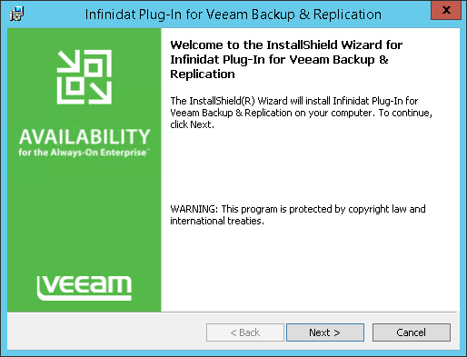
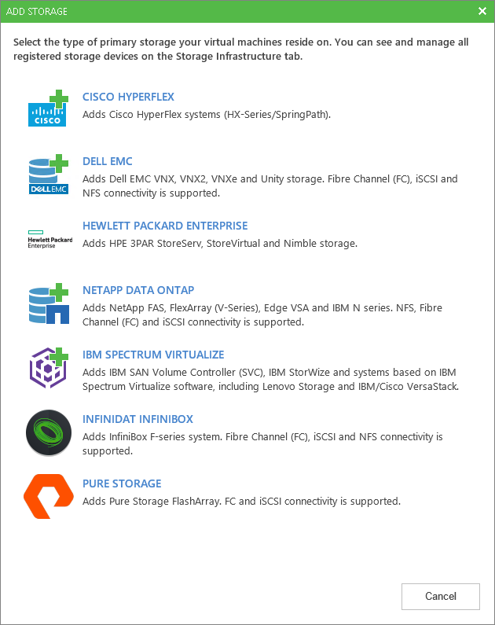

# Universal Storage Integration API

Veeam Backup & Replication offers built-in integrations with storage systems to help decrease impact on the production environment and significantly improve RPOs. Storage vendors, in turn, can leverage Veeam Universal Storage API framework to integrate their storage solutions with Veeam Backup & Replication. With this kind of integration Veeam Backup & Replication uses snapshots of Universal Storage API integrated systems to perform backup and restore operations.

The following storage systems are supported:

INFINIDAT InfiniBox
Pure Storage FlashArray

## Plugin Installation
To start working with Universal Storage API integrated systems, you must perform the following steps:

Download the corresponding storage system plug-in from www.veeam.com/backup-replication-download.html:

INFINIDAT Plug-In for Veeam Backup & Replication
Pure Storage Plug-In for Veeam Backup & Replication

To install the plug-in, perform the following steps:

Run the plug-in installation file.

If you connect to the backup server remotely with the Veeam Backup & Replication console, you must install the Universal Storage API integrated system plug-in both on the backup server and the machine where you run the console.

##Launch Storage Installation Wizard

1. Open the Storage Infrastructure view. In the working area, click Add Storage. In the displayed window, select the storage system you plan to add.

