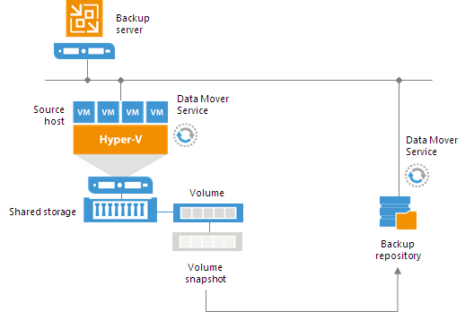
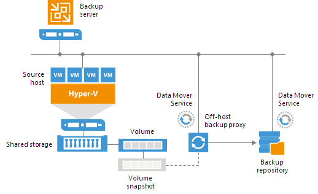

# Proxy Server - Microsoft Hyper-V

In Microsoft Hyper-V environments VMs usually reside on local storage and CSV (Cluster Shared Volume). Veeam Backup & Replication leverages the VSS (Volume Shadow Copy) framework and proprietary Microsoft Hyper-V components to retrieve data and it acts as the VSS requestor. Interacting with the VSS framework, it obtains information about the infrastructure and identifies volumes where VM files are located and triggers the VSS coordinator to create the volume snapshots.

The backup process, in Microsoft Hyper-V environments, expects the VM to be quiesced before taking the snapshot of the volume to make sure that there are no incomplete transactions in a database or no open files.
Veeam Backup & Replication uses three methods to prepare Hyper-V VMs for backup:
 - [Online backup](https://helpcenter.veeam.com/docs/backup/hyperv/online_backup.html?ver=95) - the native Microsoft Hyper-V method for creating application-consistent backup without any downtime.

 - [Offline backup](https://helpcenter.veeam.com/docs/backup/hyperv/offline_backup.html?ver=95) - an alternative native method to obtain consistent backup. It requires a little downtime: Hyper-V uses the OS hibernation to freeze the VM's I/O.

 - [Crash-consistent backup](https://helpcenter.veeam.com/docs/backup/hyperv/crash_consistent_backup.html?ver=95) - Veeam's proprietary method that allows the creation of crash-consistent backup without hibernating nor suspending the VM (no downtime required).

 Whenever possible, Veeam Backup & Replication uses online backup to quiesce VMs. If online backup cannot be performed, Veeam Backup & Replication uses one of the other two methods to prepare a VM for backup.

**Note:** If online backup cannot be performed, Veeam Backup & Replication fails over to the crash-consistent backup.
If you do not want to produce a crash-consistent backup, you can instruct Veeam Backup & Replication to use the offline backup method.

## On-host backup
This is the default and **recommended** backup method as it works out of the box.
On-host backup mode uses the native Microsoft Hyper-V VSS provider which is proven to be stable and reliable.
During on-host backup processing, VM data is processed by the source Microsoft Hyper-V host the VM is running on, and the role of the backup proxy is assigned to the Hyper-V host which owns the CSV (Cluster Shared Volume) according to the following rules:

  - If you back up or replicate VMs whose disks are located on a CSV in Microsoft Hyper-V Server 2012R2 or 2016, and Microsoft CSV Software Shadow Copy Provider is used for snapshot creation, Veeam Backup & Replication assigns the role of an *"on-host backup proxy*" to the host owning the CSV. If VM disks are located on different CSVs, Veeam Backup & Replication may use several on-host backup proxies, which are the corresponding hosts owning the CSVs.

  - In case you perform backup or replication of VMs whose disks are located on a CSV in Microsoft Hyper-V 2008 R2, and a VSS software or hardware provider is used for snapshot creation, Veeam Backup & Replication assigns the role of an *"on-host backup proxy"* to the host on which the processed VM is registered.

The on-host backup process works in the following way:
  1. Veeam Backup & Replication requests the native Hyper-V VSS provider to create snapshots of the corresponding volumes.
  2. The Veeam Data Mover service that runs on the Hyper-V host mounts the snapshots, starts processing VMs' data and transfers it to the destination (either a backup repository or a secondary Hyper-V infrastructure).
  3. Once the operation is complete, the volume snapshot is deleted.

  

## Off-host backup
In this backup mode, backup operations are moved from the Hyper-V hosts to one ore more dedicated physical server(s).
The Veeam Data Mover service running on a dedicated machine, called *"off-host proxy"*, retrieves VM data from the source volume using *"transportable shadow copies"*. This technology allows Veeam Backup & Replication to create a snapshot of the CSV (Cluster Shared Volume) on which VM disks are saved and then import and mount this snapshot onto a different server which is part of the same SAN (Storage Area Network).

Off-host backup mode requires third-party components that are not shipped with Veeam Backup & Replication: the so called **VSS Hardware Provider**, which are usually distributed as part of client components supplied by the storage vendor. These VSS providers must be tested in your dedicated environment (e.g. a MS Cluster and multi Off-Host Proxy environment). Please also check the storage snapshot logs after backup.

For more information regarding the off-proxy requirements, refer to the [official documentation page](https://helpcenter.veeam.com/docs/backup/hyperv/offhost_backup_proxy.html?ver=95).

The off-host backup process works in the following way:
  1. Veeam Backup & Replication triggers a snapshot of the required volume on the Microsoft Hyper-V host.
  2. This snapshot is mounted to the *"off-host backup proxy"*.
  3. The Veeam Data Mover service running on the off-host backup proxy processes VM data on the mounted snapshot and transfers it to the destination (either a backup repository or a secondary Hyper-V infrastructure).
  4. Once the operation is complete, the snapshot is detached from the off-host proxy and deleted from the storage system.

  
