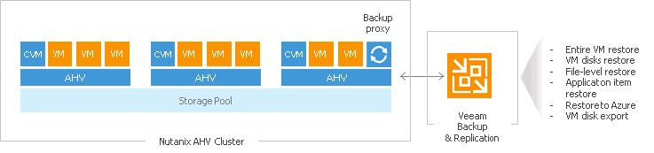
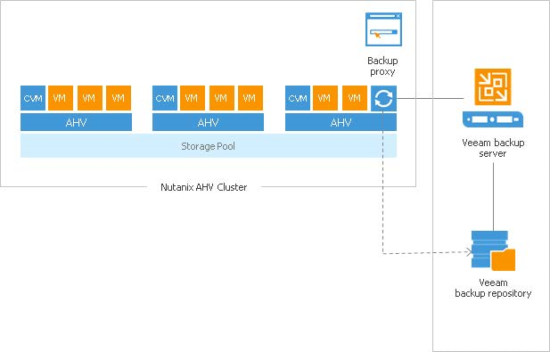

# Proxy Server - Nutanix AHV

To back up Nutanix AHV VMs, Veeam Backup & Replication uses an agentless approach. The solution works at the hypervisor level. It creates image-based backups of VMs, capturing the whole VM data at a specific point in time, including OS, system state data, application data and so on. Backups of Nutanix AHV VMs are stored on Veeam backup repositories in the native Veeam format. You can use the resulting backup files for different restore scenarios:

- Entire VM restore
- VM disks restore
- File-level restore
- Application item restore
- Restore to Microsoft Azure
- VM disk export

## How It Works: Integration Details
The core component enabling Veeam integration with the Nutanix AHV platform is a backup proxy. The backup proxy is a Linux-based virtual module that acts as a broker, or coordinator between the Nutanix AHV platform on one side and the Veeam backup server on the other side.
The backup proxy in the Nutanix integration scheme is an all-in-one box that is responsible for backup, entire VM restore and VM disk restore operations. The backup proxy communicates with the AHV platform via Nutanix RESTful API, assigns necessary resources for backup and restore operations, reads/writes data from/to AHV datastores and transports VM data to/from target Veeam backup repositories. The backup proxy is also responsible for job management and scheduling, data compression and deduplication, applying retention policy settings to backup chains, as well as performing other backup and restore related activities.

A proxy deployed in one cluster can only serve that cluster. That is, if to backup and restore VMs from another cluster you will need to deploy another proxy running on that specific cluster.

Backup proxy comes with a web-based portal that allows users to perform the following tasks:
- Configure connections to components in the Veeam backup infrastructure.
- Configure and run backup jobs for Nutanix AHV VMs.
- Restore VMs back to Nutanix AHV clusters.
- Restore VM disks and attach them to VMs hosted on Nutanix AHV clusters.

In addition to restore options available in the backup proxy web portal, administrators working with the Veeam Backup & Replication console can also perform the following data recovery operations with backups of Nutanix AHV VMs stored on Veeam backup repositories:
- Restore VM guest OS files
- Restore application items
- Export VM disks to VMDK, VHD and VHDX formats
- Export VMs to Microsoft Azure
