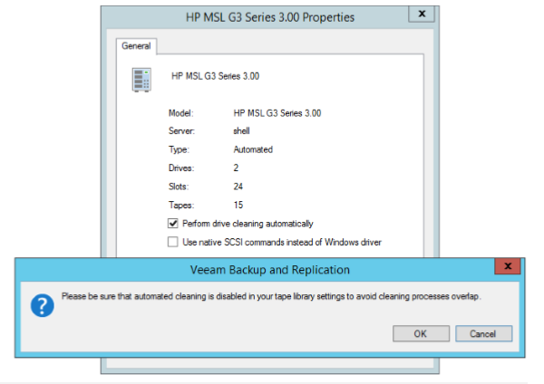

<!--- This was last Changed 03-05-17 by PS --->
## Media Management

### Automated Drive Cleaning
You can instruct Veeam Backup & Replication to automatically clean the tape library drives. Assigning the automated cleaning to Veeam Backup & Replication prevents possible overlapping of cleaning tasks and tape jobs. Such overlapping may cause tape jobs failures. To instruct Veeam Backup & Replication to automatically clean the drives:

1.  Open the Tape Infrastructure view.
2.  Expand the Libraries node and select the needed library. Click Properties on the ribbon. You can also right-click the necessary library in the working area and select Properties.
3.  In the Properties window, select the Perform drive cleaning automatically option.

If you enable the automated drive cleaning option in Veeam Backup & Replication, make sure that you disabled the drive cleaning tasks on your tape library device.

Veeam Backup & Replication cleans the drives at the beginning of backup to tape jobs or file to tape job run. The cleaning is not performed during other tape operations such as, for example, cataloging or export. To clean the drives automatically, Veeam Backup & Replication performs the following actions:  

1.  The tape library alerts Veeam Backup & Replication on a drive that requires cleaning.
2.  Veeam Backup & Replication waits for a tape job to start.
3.  When the tape job locks necessary drives for writing data, Veeam Backup & Replication checks which of them requires cleaning.
4.  Veeam Backup & Replication ejects the tape from the drive, inserts a cleaning tape and performs the cleaning.
5.  Veeam Backup & Replication ejects the cleaning tape and inserts the tape that was reserved for the tape job.
6.  The tape job writes the data on tape.

The cleaning process usually takes several minutes.

The cleaning tapes are located in the Unrecognized media pool. The worn-out cleaning tapes are moved to the Retired media pool automatically.

If a tape job locks multiple drives simultaneously for parallel processing, and one or more drives require cleaning, all drives wait until the cleaning is finished. After cleaning, all drives start writing simultaneously.

The automated drive cleaning does not affect creation of media sets.

**Limitations for Automated Drive Cleaning:** You cannot enable the automated drive cleaning on standalone tape drives. You cannot start the drive cleaning manually with Veeam Backup & Replication. The drive cleaning is fully automated.

### Working with Tape Libraries
All tape libraries managed by Veeam Backup & Replication are shown as a list of devices under the Libraries node in the Tape Infrastructure view. All connected devices are discovered automatically during the rescan procedure. When you add a new tape device to the tape server, it appears in your console after rescan. To view properties of a tape library:
1)  Open the Tape Infrastructure view
2)  Expand the Libraries node and select the needed library.
3)  Click Properties on the ribbon. (You can also right-click the necessary library in the working area and select Properties).
4)  Select the Perform drive cleaning automatically check box if you want Veeam Backup & Replication to manage the tape drives cleaning.

For more information about automated drives cleaning, see Automated Drive Cleaning. Select the Use native SCSI commands instead of Windows driver check box if your library is an unknown media changer.

### Media Information
Veeam Backup Database Veeam Backup & Replication catalogues information of all archived data and stores this information in the Veeam backup database. The registered tapes stay in the database until you remove the information about them. You can always view details for each tape, for example, information about backups written to it, even if the tape is not inserted in the library. The catalogue lets quickly detect location of the required items on tape. The catalogue correlates the archived files and the restore points to the names of the corresponding tapes. Both online or offline, and the names of the media sets within were the data was written.

When you start restore, Veeam Backup & Replication prompts for the tapes you need to bring online. As a result, you can restore data from tape much quicker. Veeam Backup & Replication uses the following catalogues for storing the tape-related data:
-	Tape Catalogue stores information about files/folders archived to tape media with file to tape jobs, as well as backup files produced by backup to tape jobs. The content of the Tape catalogue can be examined in the Files view.

-	Backup catalogue stores information about VMs whose backups are archived to tape media with backup to tape jobs. The content of the Backup catalogue can be examined under the Backups > Tape node in the Backup & Replication view

### Media Pool

A media pool simply defines a group of tapes managed by Veeam Veeam Backup & Replication. There are three types of media pools:

-   **Service media pools**. Created and managed automatically. It is not possible to modify their settings. They contains:

	-   Empty media starts out in the **Free pool** indicating it’s
    available for use in other pools.

	-   Unknown media will be placed to the **Unrecognized pool** so that it
    is not overwritten.

	-   After inventory or cataloging, media with existing data is placed into
		the **Imported pool**. Review the contents and place such media into the **Free**
    pool for overwrite or leave in **Imported pool** to keep the data.

	-   Exhausted or broken tapes are placed into the **Retired pool** and
    are not used further.

-   **Media pools** are groups of media to which backup data can be written.

    -   You can create as many custom media pools as needed.

    -   Media can be assigned to a pool manually, or configured to be
        automatically assigned from the free pool.

    -   Configure each pool settings according to the purpose of the
        pool, such as the overwrite protection period that is applied to
        all media within the pool.

    - 	Since v9 a (Custom) Tape Pool can be spanned over multiple tape
    	libraries. The idea is to use the capacity and drives of multiple
        tape systems together and to failover to another tape library in
        case one library goes offline.

- 	**GFS media pools** are used to store weekly, monthly, quarterly and
		yearly backups on tape.
    -   You can create as many GFS tape pools as needed.

    -   Media can be assigned to a pool manually, or configured to be
        automatically assigned from the free pool. As well optional can define
        specific tapes for specific media sets (for example yearly backups).

    -   Configure each pool settings according to the purpose of the
        pool, such as the overwrite protection period that is applied to
        all media within the pool.

### Media Set

A media set is a subset of a media pool that contains at least one
backup. A new media set can be created for every backup, or on a time
based schedule (i.e. weekly). It is also possible to reuse the same media set
forever. When a media set contains at least one full
backup, it is a self-sufficient restore point. It means that if you have
all tapes from the media set at hand, you can be sure that restore will
be successful.

### Media Vault

A media vault is used to organize offline media. For example, you have a
service organization that transports the tapes to a safe at a bunker.
You can name the vault accordingly and add some useful information in
the description (phone number, place, etc.). When you need to transport
physical tapes to the safe, add these tapes to the vault manually or set
automatic export of offline tapes to a vault in the tape jobs or media
pools properties.

## Backup Modes

Backup jobs can create different backup types of backup file chains on disk
depending on the backup mode used. Depending on backup mode, "Backup to Tape"
jobs either copies files to tape or synthesize a full backup. The following
rules apply:

-   When archiving reverse incremental backups, the behavior varies on the
	type of media pool used:
	- **Standard Media Pool:** The tape job will always
	copy the full backup and ignore any rollback files (VRB)
	- **GFS Media Pool:** The tape job will create a full backup from VRB
	files on specified day(s) as per schedule.

-   When archiving forward incremental backups, _with_ active
    or synthetic full scheduled, the backup chain on tape will be
    a copy of the backup chain on disk. The virtual full option in tape
    job configuration is ignored.

-   If you archive forward incremental backups without synthetic or active
    full enabled, or archive Backup Copy Jobs, the full files are synthesized
    from existing restore points on disk. The virtual full
    backup schedule can be configured on the "Backup to Tape" job.

For more
		information about virtual full to tape, please see [Veeam Help Center](https://helpcenter.veeam.com/docs/backup/vsphere/virtual_full_backup.html?ver=95

If the source backup job contains multiple chains, and the checkbox
"Process latest full backup chain only" in advanced job settings is unchecked,
you will be prompted for a decision, when creating a Backup to Tape job. You may
choose to either only the last backup chain or all existing restore points.

## Sizing

For the highest throughput, enabling [parallel processing for the Backup to Tape](https://helpcenter.veeam.com/docs/backup/vsphere/parallel_processing.html?ver=95)
is recommended. You need to size the servers
and storage connection accordingly. It can be helpful to create multiple
partitions with 2-4 tape drives and add these partitions
to different tape servers. Adding these libraries to the [media pool](https://helpcenter.veeam.com/docs/backup/vsphere/add_media_pool_tapes.html?ver=95)
and enabling parallel processing will distribute the load across multiple
drives and tape servers.

**Note:** Parallel processing for tape is unavailable for GFS media pools.

Install Windows 2012 R2 or above on the tape server for best performance. Use the
latest Veeam version and patch level as they often contain tape throughput
optimizations.

Perform a POC to test throughput of tape and disk. If you have no opportunity to
test speed, assume that the lowest speed for backup to tape jobs with
LTO5/6 is 50MB/s as a conservative estimate. We highly recommend
to do a POC to evaluate real throughput to avoid additional hardware costs.

The GFS (Grandfather, Father, Son) tape job can help avoid a complex
Backup to Tape job creation by handling weekly, monthly, quarterly and yearly
backups in a single job.

For Backup to Tape jobs that use forward incremental (without synthetic or
active fulls) jobs or Backup Copy Jobs as source of the data, it may be required to
temporarily disable the job using pre- and post scripts, as the transform
process of forever incremental forever will terminate the tape job. Another
option is to increase the restore points of these jobs temporarily. By increasing
the number of restore points for the source job, the Backups to Tape job will
not be terminated by the merge process. However, please note this will increase
the transform time significantly once the setting is reverted and is highly
discouraged for large jobs. An example of this implementation can be found here:
[v9 GFS job - No more continuous?](https://forums.veeam.com/tape-f29/v9-gfs-job-no-more-continuous-t32336.html)

## Using 3rd party tape software

As Veeam Backup & Replication tracks and orchestrates all backups
written to tape, Veeam recommends using the built-in Veeam tape
features (Backups to Tape and Files to Tape jobs).

However, in some situations you may want to use an existing library with
non-LTO tapes, or you need to integrate Veeam Backup & Replication into
an existing backup-to-tape software. Veeam backup files contain all
information needed for restore (e.g. deduplication information, VM
metadata, etc.), and you can use the existing backup-to-tape solution to
bring the Veeam backup files on tape. This approach can also support
enterprise customer "Segregation of duty" demands as two complete different
teams can handle backups and tape backups. No single person can delete by
mistake or on purpose the primary and tape chain. Before having two backup
solutions co-exist on the same server, please verify they do not conflict each
other.

## Tape Encryption

Veeam uses hardware encryption if it is provided by the tape device and
enabled in Veeam Backup & Replication. Tape library should work in the
application-managed encryption mode.

If the hardware based encryption is not supported by the tape device,
software based AES-256 encryption is used. Please note software based encryption
may cause significant performance degradation, if not natively accelerated by
the CPU of the tape server.

Hardware based encryption is typically available for LTO-4 or newer libraries,
and while a license is often required, this is usually supported for free
by the tape library vendor.

When archiving data, Veeam generates a user key which is stored with
data on tape. If you restore data using another Veeam backup server,
provide the password or utilize the Password Loss Protection
in Enterprise Manager. See the [User Guide](https://helpcenter.veeam.com/docs/backup/vsphere/encryption_tape.html?ver=95)
for more information.

If the hardware encryption option is used, and you archive to tape Veeam
backups that are already encrypted on disk, they will be encrypted
twice. If you restore such backups with double encryption on the same
Veeam backup server they will be decrypted automatically. To decrypt on
another Veeam backup server, you will need to enter the two passwords
accordingly.

For additional details on tape encryption, see the corresponding section
of this guide > [Encryption](../job_configuration/encryption.md)

## Tips
- 	"Short Erase" all tapes before use with Veeam to avoid any problems
	cause by data from other backup software
-   Install latest Windows Updates
-   Install latest firmware on library, drives, HBA (verify interoperability)
-   Install separate HBAs for tape is recommended, but not required
-   A staging area for backup files is required when restoring from tape. Keep this in mind when sizing backup repositories.
-		Tape compression should be disabled for tape jobs, when backup files
are already compressed at the backup repository
- "File to Tape" engine is optimized for smaller amount of big files (e.g. backup files) only
