## Veeam vCloud Director Self-Service Portal

vCloud Director Self-Service Portal is designed for service providers running VMware vCloud Director and willing to offer self-service capabilities to their tenants. With the portal, users can configure their own backup jobs, and restore virtual machines and single files without any intervention from the service provider. From a technical point of view, the portal is an additional component of Veeam Enterprise Manager, and as such it is installed during the Enterprise Manager installation.

### Requirements and limits ###

* Supported versions of vCloud Director are: 8.10, 8.0, 5.6, 5.5.
* only one vCloud Director installation (single cell or cell cluster) can be managed by a single Enterprise Manager. If a service provider has multiple vCloud Director installations, they will require the same amount of Enterprise Managers to protect all of them.
* vCloud Director Self-Service Portal cannot be installed on a different machine than Enterprise Manager. For this reason, plan the placement and the security of the Portal accordingly.

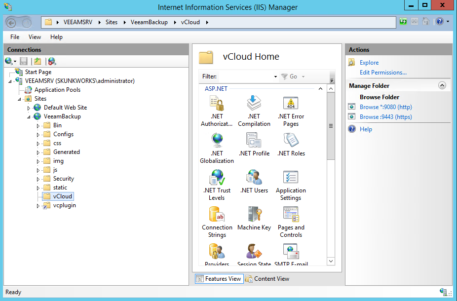

In order to harden the installation of the vCloud Portal, administrators can work on the IIS (Internet Information Server) website created by Veeam installer, and leverage all the security features available in IIS itself.

**NOTE:** *Because the vCloud Portal is a subfolder of the Enterprise Manager installation, in order to modify its settings, the same settings need to be edited for the entire installation.*

### File Level Restore for Windows VMs

When a file needs to be restored for a Windows VM, a tenant uses the Self-Service Backup Portal to mount and browse a backup set (or he can use the search function to look for the same file):

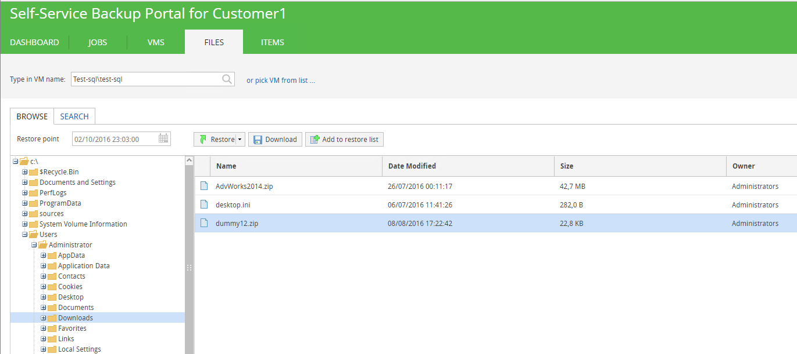

The mount operation of the index is instantaneous, and a tenant can browse the content of the backup set to look for the file(s) he needs. Once the file has been identified, there are three different options:

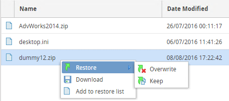

* tenant can download the file locally into his own workstation from the Self-Service Backup Portal
* tenant can restore the file in its original location inside the guest VM, overwriting the previous version
* tenant can restore the file in its original location inside the guest VM with a new name, so that both the new and the previous versions are kept

Option 2 and 3 use the same restore mechanism: Veeam first tries to connect to the Guest VM via the network, but since this is usually an isolated network inside vCloud Director and there is no direct connectivity between the vCloud Organization Network and the management network where Veeam (actually, the mount server) is deployed, VMware VIX API (up to vSphere 6.0) or VMware vSphere Guest Interaction API (starting from vSphere 6.5) are used to complete a networkless restore.

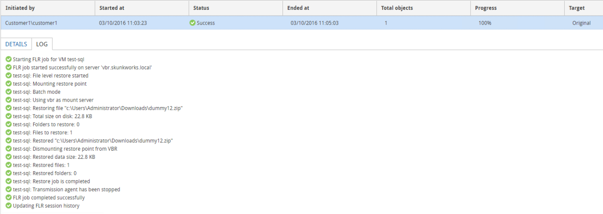

The file is restored in the original location, with the “RESTORED-“ prefix:

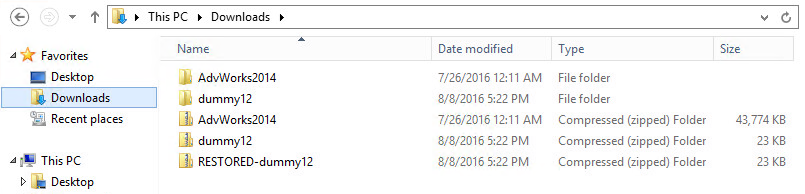

** NOTE:** *vSphere API used for these operations are mainly designed for executing commands inside the Guest OS, not for file transfers. For this reason, performance of large file restore operations may not be optimal. Please consider the "Download" option for such activities.*

### File Level Restore for Linux VMs

When a file needs to be restored for a Linux VM, some additional configuration needs to be completed by the service provider, otherwise the tenant will not be able to execute any restore.

Veeam Backup & Replication uses a Multi-OS FLR Helper Appliance virtual appliance to run file level restores for non-Microsoft file systems. This appliance is configured by a Veeam administrator before it can be used for any file restore. Otherwise, the first time a tenant tries to restore a file for one if his Linux VMs, he will receive this error in the Self-Service Backup Portal:

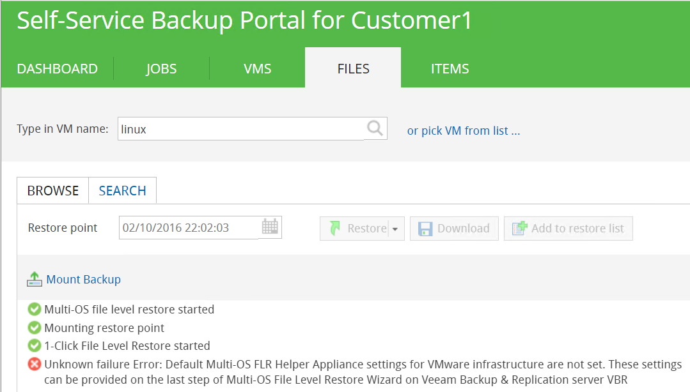

A Veeam administrator needs to configure the appliance from the Veeam Console. This can be achieved by initiating a file lever restore for any Linux VM:

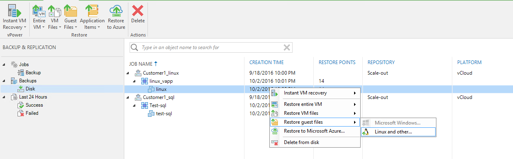

The restore wizards asks to configure the Helper Appliance. The wizard suggests that the appliance should be connected to the same network where the guest VM is located, but it misses the other important information, that the FLR appliance needs to connect first of all to the Veeam mount server via port TCP/6170.

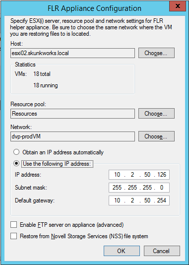

In this example, **dvp-prodVM** is a management network where the different Veeam components are running. Once the FLR appliance is configured from the Veeam Backup Server, its configuration can be used also from the Self-Service Backup Portal by a tenant to mount the backup in the web interface:

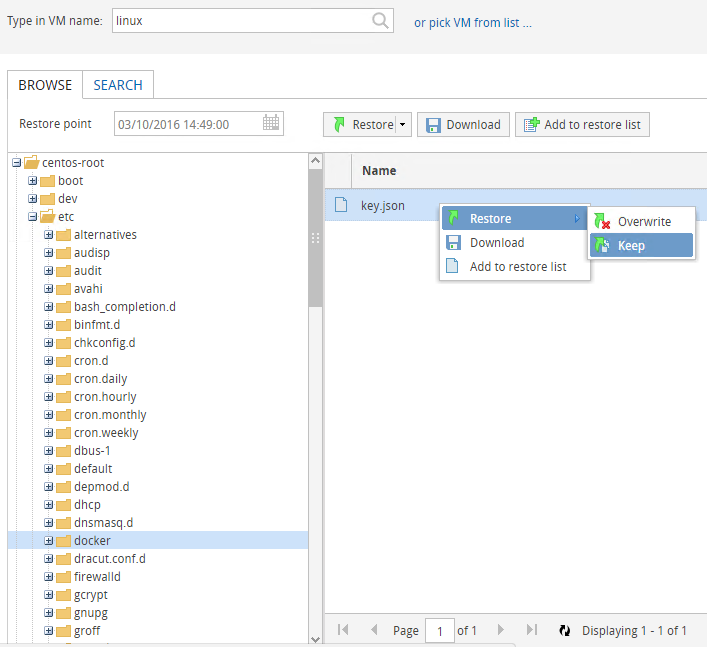

The tenant has the three different options to restore one or more files from the backup set. While the Download option is immediately consumable by the tenant, the two Restore options require even more networking configurations, as the Veeam Backup Server would try to connect to the Guest VM to start the restore process from within the guest, but since there’s no network connectivity between the two, it will fail:

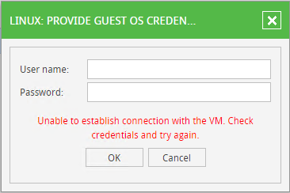

For this reason, when Veeam Backup & Replication is used in completely fenced environments, we suggest to leverage the download options of the vCloud Self-service portal, and let tenant consume this portal to retrieve the files they need. To avoid a double operation of downloading the file to their workstations and then uploading them again to the linux machine, we suggest as a best practice to access the portal from a virtual machine already running inside the vCloud virtual datacenter. If the machine used to retrieve the files is not the final destination of the restored files, a tenant will just need a tool like WinSCP to transfer the file to the linux machine, but both the download and the scp copy will happen in a local network, with the files not even leaving the service provider datacenter.

### Multiple concurrent restores

If the service provider is offering the self-service capabilities of the Veeam vCloud Portal, it could not be so uncommon that multiple tenants will start a restore operation at the same time.

**Customer1** owns a single linux virtual machine called **linux**, inside the **linux_vapp** vcloud app. He wants to restore a file from the latest backup, so he starts the procedure from the self-service portal as described before; the customer selects the restore point and asks the software to initiate the mount operation.

The customer can browse the content of the backup, do searches, and download any file he may need. In the backend, Veeam Backup & Replication is using the FLR Appliance to mount the backup and read the linux filesystem used by the linux virtual machine.

The machine is automatically disposed (powered off and deleted from the vSphere environment):
* After 15 minutes of inactivity from the vCloud Portal
* If the restore operator logs out from the vCloud Portal

For the entire duration of the restore process, the FLR will be powered on and used by the tenant.

The configuration of the FLR appliance can be done in two ways, by **assigning a fixed IP address** or by **leveraging a DHCP server**. As the appliance is often managed as a regular server, and to be sure it always have an IP address to start and execute the restores, many administrators configure it with a static IP address. The IP 10.2.50.126 in our example is a static IP address as you can see from the previous screenshot.

During a file restore from the portal, Veeam Backup & Replication uses the existing configuration of the FLR appliance, since there is no possibility to change the configuration from the portal itself. This works perfectly for one single restore operation, but if another tenant tries to do a file restore for one of his linux machines after the first customer is already performing a restore, an error will be returned:

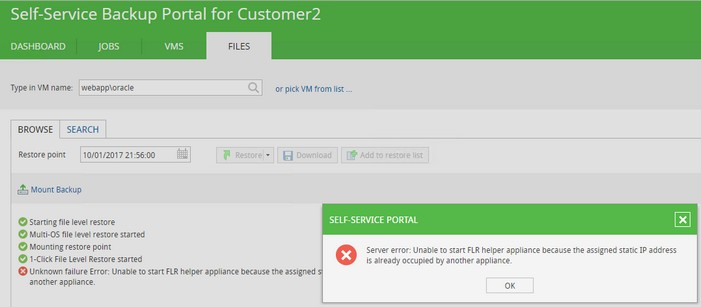

**Customer2** has to wait until **Customer1** has no restore operation running anymore, before he can start his own restore. This is done on purpose to avoid multiple FLR appliances to be spin up using multiple times the same IP address, thus leading to unexpected results.

To allows multiple concurrent restores, the solution is to configure the FLR appliance with a dynamic IP address, once a service provider has verified that a DHCP server is available in the port group where the appliance will be connected:

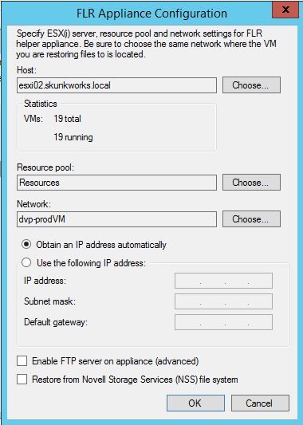

With this configuration, multiple restore operations can be supported:

