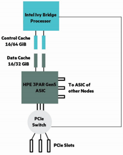
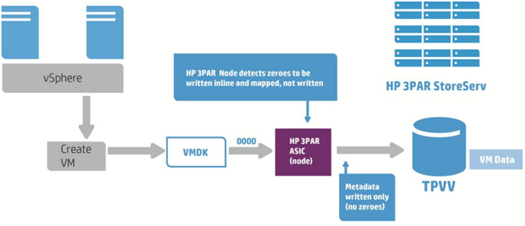

# Restoring VMs to an HPE 3PAR with thin disks

Restoring a VM with thin disks leads to a painful slow restore on HPE 3PAR arrays.
Usually this condition happens only when restoring backups taken from another infrastructure to a new one, based on HPE 3PAR. Leaving restore options with all the default value, the original format of the virtual disks is kept and if the restored VMs had originally thin provisioned disks, it will be restored with the same format.
HPE best practices’ regarding 3PAR is to provision VMs using think disks.

## 3PAR useful facts

3PAR has a built-in chip, ASIC, used for features like zero-detection, RAID calculation and dedupe/compression:

ASIC can eliminate zeros inline, avoiding useless writes on a virtual volume (LUN):

When a thin-provisioned VM is deleted, the underlying array is not informed that the data is no longer in use (this is an expected behavior in vSphere – that’s how it works) and, when writes occur, the previously allocated blocks must be first purged. There is a manual procedure, described here, to manually trigger the unmap of these blocks.
What is not working as expected with 3PAR arrays is that when a write in thin provision mode occurs on previously written blocks, ASIC cannot intercept zeroes and an unexpected data format leads to poor write performances.
The same condition would not happen if you restore thin provisioned disks on newly created 3PAR virtual volume.

When restoring VMs on a 3PAR based infrastructure, force the restore in thick (lazy zeroed works as well – and will also save some time) if source VM were created with thin disks. All the zeroes will be automatically detected, skipped and never written. There will much less writes and less I/O flowing to the array.

## Additional resources

[Why the right architecture matters with vSphere](https://www.vmware.com/content/dam/digitalmarketing/vmware/en/pdf/techpaper/HP-3PAR-StoreServ-Why-the-right-architecture-matters-with-vSphere.pdf)

[HPE 3PAR StoreServ Storage and VMware vSphere 6.5 best practices](https://h20195.www2.hpe.com/V2/getpdf.aspx/4AA4-3286ENW.pdf)

[HPE 3PAR VMware ESX/ESXi Implementation Guide](https://support.hpe.com/hpsc/doc/public/display?docId=c03290624)

[HPE 3PAR StoreServ Architecture](https://h20195.www2.hpe.com/v2/getpdf.aspx/4aa3-3516enw.pdf)
