# Data DellEMC DataDomain Advanced Scalability Design

The following document explains how to configure VBR when using multiple proxies that write backups on the same Dell EMC Data Domain.

When it comes to big environments, using the default configuration and let all proxies that process VMs backups passing through a single gateway server, to write data on the Data Domain, could not be the best option. Gateway server is a component that must be properly sized to avoid bottlenecks along the way to the repository and, if it is not explicitly fixed in the repository configuration, one will be picked based on the software logic (see [selection algorithm](##Selection-Algorithm)).

Rather than using the default configuration, this document provides guidelines to achieve the maximum parallelism by having all the proxies writing on a different repository (proxy and gateway roles are on the same server). To reduce management overhead, all the Dell EMC Data Domain repositories will be grouped in a single Scale-out Backup Repository.

## Gateway server role explained

From the user guide:

A gateway server is an auxiliary backup infrastructure component that “bridges” the backup server and backup repository. The gateway server is required if you deploy the following types of backup repositories in the backup infrastructure:

- Shared folder backup repositories
- Dell EMC Data Domain deduplicating storage appliance
- HPE StoreOnce deduplicating storage appliance

Shared folder repositories, EMC Data Domain and HPE StoreOnce cannot host Data Mover Services — Veeam components that establish a connection between a backup proxy and backup repository (in case of backup jobs) or between backup repositories (in case of backup copy jobs). To overcome this limitation, Veeam Backup & Replication uses gateway servers.
In the backup infrastructure, a gateway server hosts the target Veeam Data Mover. Veeam Backup & Replication establishes a connection between the source Veeam Data Mover and target Veeam Data Mover, and transports data from/to backup repositories via gateway servers.

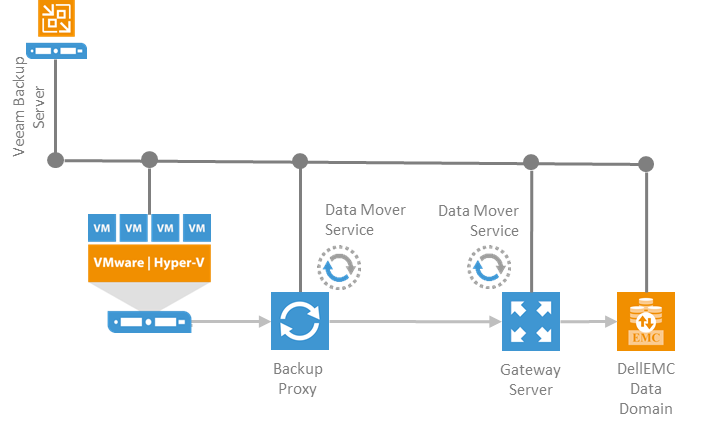

### Selection Algorithm

| Tye of job | Gateway server | Synthetic operations |
| -- | -- | -- |
| Backup job | Backup proxy that was assigned the first to process VM data for a backup job. | Synthetic operations are performed on the mount server associated with the backup repository. If the mount server is not accessible, Veeam Backup & Replication fails over to the backup server. |
| Backup copy job | Direct data path: mount server associated with the backup repository. If the mount server is not accessible, Veeam Backup & Replication fails over to the backup server. Over WAN accelerators: source and/or target WAN accelerator (depending on the shared folder backup repository location). | Synthetic operations are performed on the mount server associated with the backup repository. If the mount server is not accessible, Veeam Backup & Replication fails over to the backup server. These rules are applied to the direct data path and processing over WAN accelerators. |
| Tape job | If there is a direct connection between a backup repository and tape device, the role of a gateway server is assigned to the tape server. Otherwise the role of a gateway server is assigned to the backup server. | Synthetic operations are performed on the mount server associated with the backup repository. If the mount server is not accessible, Veeam Backup & Replication fails over to the backup server. |
| Restore operations |Backup proxy used for a restore operation| - |
| Replication from backup|Target backup proxy assigned for a replication operation | - |

## DataDomain MTree

### MTree overview and limits

Dell EMC defines an MTree as logical partitions of the file system and they are identified by a unique name.
MTrees are used to create (protocols can be mixed, except VTL):

- DD Boost storage units
- VTL pools
- NFS/SMB shares

MTrees allow granular management of snapshots and quotas. Quotas apply only to logical data written to an MTree.

There is a fixed amount of MTrees that can be create on a Data Domain system and it depends by the model and DD OS version.

| DataDomain system  | DD OS version | Configurable MTree's | Concurrently Active MTree's |
| -- | -- | -- | -- |
| DD9800 | 6.0+ | 256 |256 |
| DD9500 | 5.7+ | 256 | 256 |
| DD6800, DD9300 | 6.0+ | 128 | 128 |
| DD6300 | 6.0+ | 100 | 32 |
| DD990, DD4200, DD4500, DD7200 | 5.7+ | 128 | 128 |
| All other DD systems | 5.7+ | 100 | up to 32 |

### MTree attributes and statistics

| Item  | Description |
| -- | -- |
| MTree Name | The pathname of the MTree (/data/col1/mtree-name). |
| Quota Hard Limit | Percentage of hard limit quota used. |
| Quota Soft Limit | Percentage of soft limit quota used. |
| Last 24 Hr Pre-Comp | Amount of raw data from the backup application that has been written in the last 24 hours. |
| Last 24 Hr Post-Comp | Amount of storage used after compression in the last 24 hours. |
| Last 24 Hr Comp Ratio | The compression ratio for the last 24 hours. |
| Weekly Avg Post-Comp | Average amount of compressed storage used in the last five weeks. |
| Last Week Post-Comp | Average amount of compressed storage used in the last seven days. |
| Weekly Avg Comp Ratio | The average compression ratio for the last five weeks. |
|Last Week Comp Ratio | The average compression ratio for the last seven days. |

## DataDomain replication overview

Data Domain Replicator is a technology that allows replication between two (or more) Data Domain systems. The replication process is network-efficient as no data re-hydrate happens when transferring data between two systems.

To reduce bandwidth usage, Data Domain Replicator performs two levels of deduplication: 

- local – determines the unique segments that must be replicated over WAN 
- cross-site – it further reduces bandwidth requirement when multiple systems are replicating to the same target (many to one architecture)

Data Domain Replicator is a **licensed feature**.

### Replication types

Replication always involves at least two Data Domain systems, identified as source and destination and each system can be either source and destination (cross-replication). The process is always asynchronous.

A Data Domain can be set up for different kind of replication, such as:

- Directory – replication based on single directory (the smallest entity within an MTree)
- Collection – entire Data Domain content
- MTree – entire MTree replication, including all subfolders

### Replication requirements

For any replication type, requirements are:

- A destination Data Domain system must have available storage capacity that is at least the size of the expected maximum size of the source directory.
- The file system must be enabled or, based on the replication type, will be enabled as part of the replication initialization.
- The source must exist.
- The destination must not exist.
- The destination will be created when a context is built and initialized.
- After replication is initialized, ownership and permissions of the destination are always identical to those of the source.
- In the replication command options, a specific replication pair is always identified by the destination.
- Both systems must have an active, visible route through the IP network so that each system can resolve its partner's host name.

## Veeam B&R Integration

### Advanced Scalability Design

#### Avoiding Bottlenecks

When dealing with enterprise environments and there are multiple proxies that process VMs data, the gateway server role that spawns on one of them can be very resources consuming and it can potentially lead to an unbalanced load between all the proxies in the pool.

By design, a backup repository can have only one gateway server therefore all the proxies will send all the data to the assigned gateway server as follow:

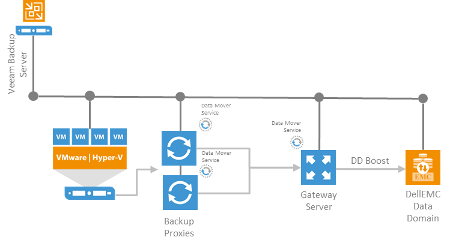

Moreover, **DDBOOST dedupe happens only between gateway and repository**. Data transfer, either proxy to proxy and proxy to gateway benefits of Veeam’s software compression only.

To avoid bottlenecks the best option is to make sure **every proxy is also its gateway server and writes backup on its own backup repository**. The architecture will look as follow:

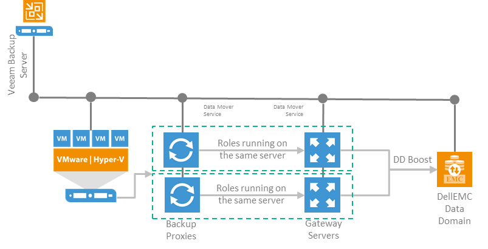

### Setting up MTree

To maintain configuration as simple as possible, all VBR backups will be written on a single MTree. Doing that, monitoring the MTree will be an easy task: all the statistics related to the MTree will apply to the entire backup set, such as dedupe ratio, compression, daily writted, etc.

Log into Data Domain management interface and create the MTree and its associated user:

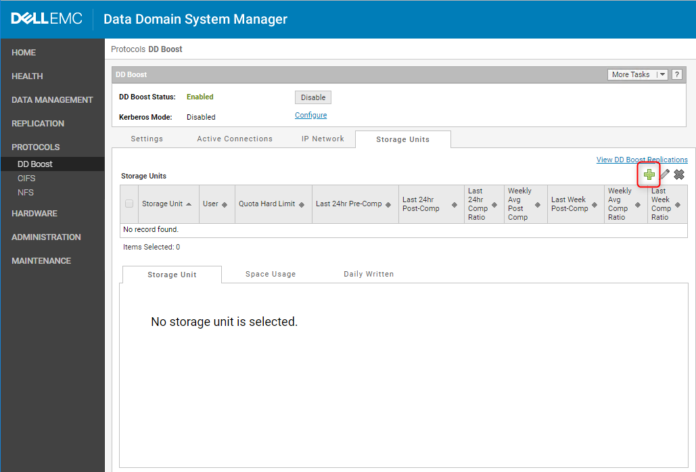

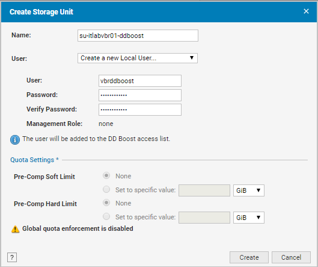

**Tip**: Name the MTree including backups server’s hostname to better identify the environment you are working on.

As soon as the MTree is created, note the path that it has on the Data Domain file system:

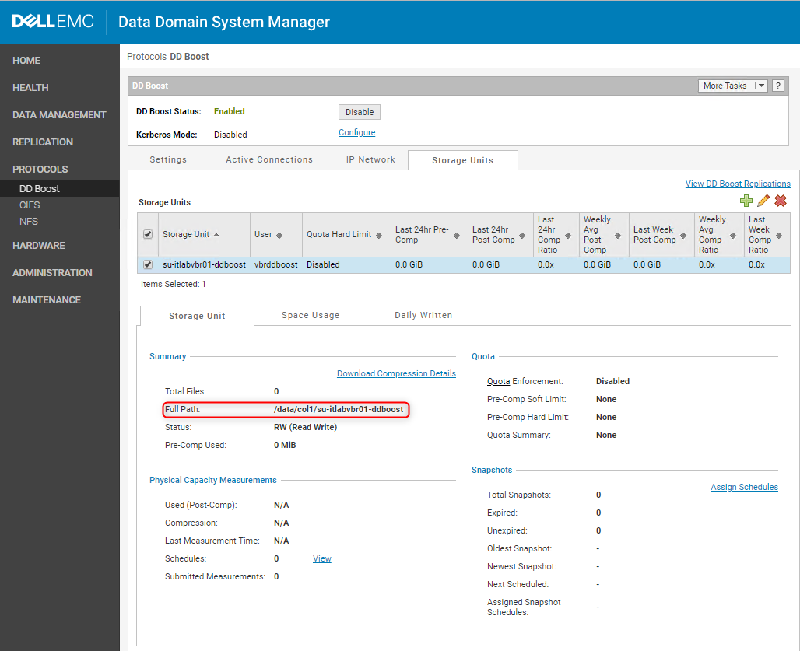

Every proxy will have its own sub-folder within the MTree (the folder will be created during the repository creation wizard in VBR):

```
/data/col1/su-itlabvbr01-ddboost/proxy_01

/data/col1/su-itlabvbr01-ddboost/proxy_02

/data/col1/su-itlabvbr01-ddboost/proxy_n
```

**This is key to maintain backup file separated and to not create any kind of inconsistences in VBR database**.

### Configuring VBR repositories

As said above, there will be one repository for each proxy processing VMs data so the following step has to be repeated for each proxy in the infrastructure.

1. Start the repository configuration wizard, select ‘Deduplicating storage appliance’ and then ‘Dell EMC Data Domain’:

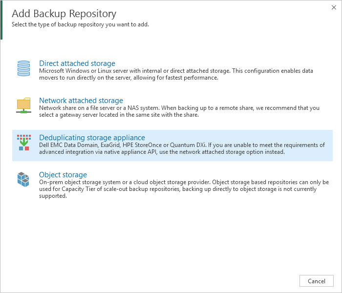

2. Name each repository including the name of the proxy that will access it (it will be easy to identify the extent once it will be part of the Scale-out Backup Repository):


3. Type in Data Domain hostname and select the proxy that will access the repository:

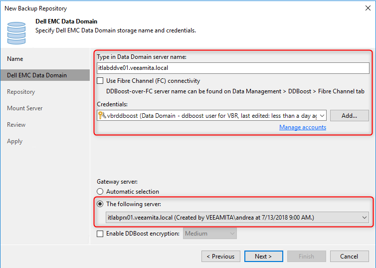

4. Browse the storage units and create the folder where the proxy (and its gateway server) will write backup files:

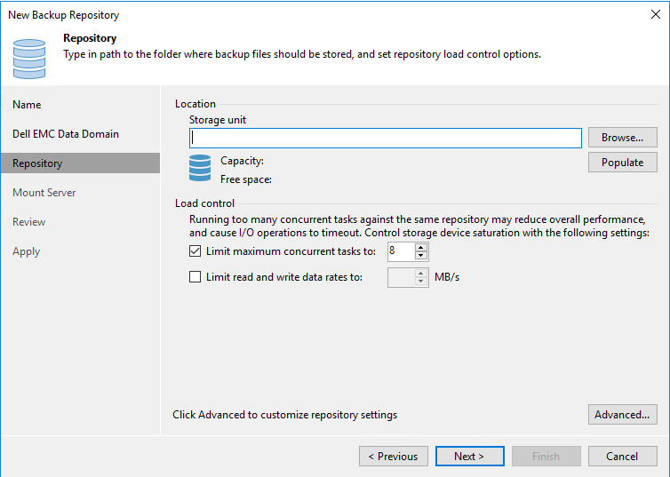


5. Select the same server for the mount server role as well, in this way all the traffic related to this extent will be isolated and will pass through the same server for both read and write:

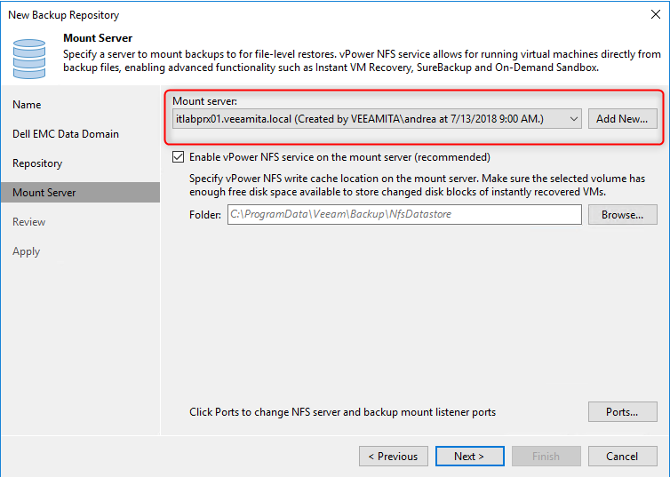

6. All the repositories needed to create the Scale-out Backup Repository are now configured. Review the configuration and make sure the MTree path is correct and every repository contains the directory where the gateway server will write the backup files:

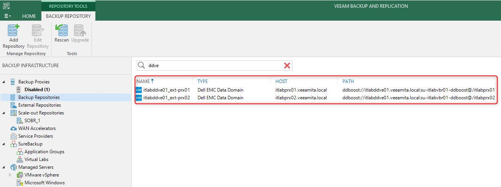

7. For each repository configure the proxy affinity to avoid unnecessary traffic between the proxies (all the proxies must reach directly their backup repository without using a different gateway server):

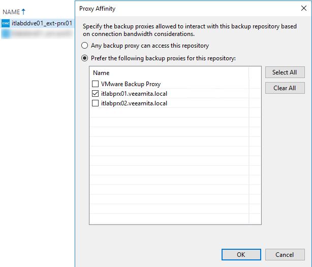

### Setting up Scale-out Backup Repository

The Scale-out Backup Repository is needed to keep the management as simple as possible and to not manually assign backup jobs to a single backup repository (and therefore to a single proxy – loosing all the benefits of the parallel processing).

1. Name the Scale-out Backup Repository:

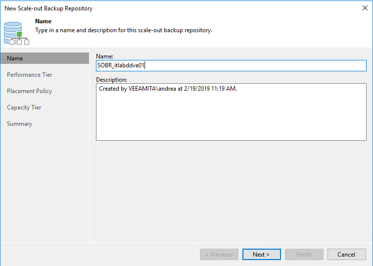

2. Add the extents:

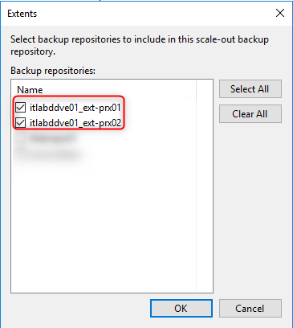

3. Set the Scale-out Backup Repository in ‘Data Locality’ mode for a better distribution of the backup file with the extents:


### Creating backup jobs

Backup jobs can be configured point the Scale-out Backup Repository and they will benefit of the parallel processing at maximum scale: VMs can be processed using all the proxies available and each proxy will write backup data directly on its extent.

1. Create the backup job and use the Scale-out Backup Repository as repository leaving proxy selection algorithm to automatic (Data Domain suggested tweaks will be set automatically):

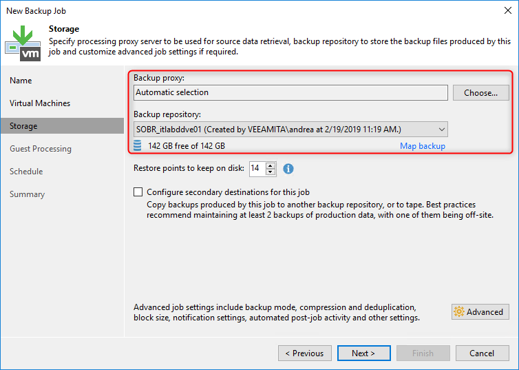

## Working with Veeam Agents

### VAW

Veeam Agent for Windows supports Dell EMC Data Domain Boost and it can write backup passing through the gateway servers.

The same architecture mentioned above can be used:

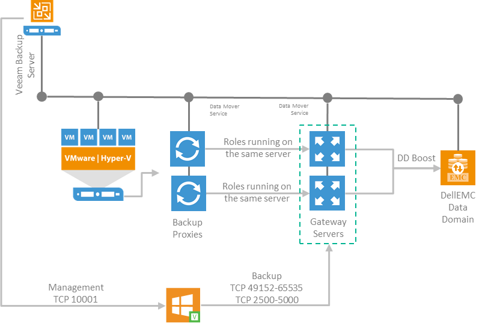

VAW jobs will use the same Scale-out backup Repository used for VMs backup.

The suggested backup mode, like any other VM job targeting a Data Domain, is incremental with synthetic full as it will be performed moving existing blocks.

### VAL

Things for Linux agents are slightly different as VAL does not support yet DDBOOST.

To overcome this limitation, it is recommended to create a dedicated MTree that will be used as NAS repositories. Even though Data Domain supports multiple protocols on the same MTree, it is not recommended: at the first repository rescan, having the same data accessible from different repositories the entire backup catalog would be imported twice (or even more times).

Depending on the number of agents deployed it is possible to leverage the same scalable architecture using either multiple gateways, each one with its own backup repositories (a sub-folder within the same MTree) or simplifying a little bit the architecture using just one repository and leaving the gateway selection to automatic.

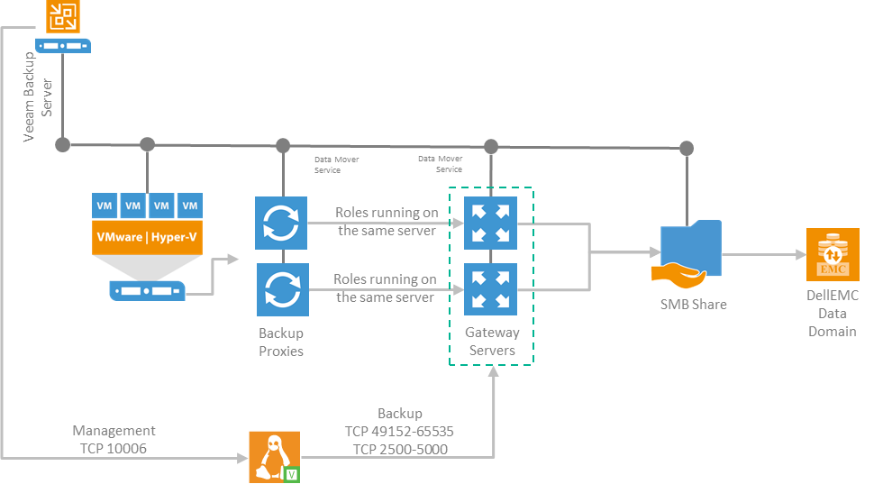

Regarding the data transfer, it will benefit of Veeam’s compression only. The deduplication will happen asynchronously, as soon as the backup files will be written on the Data Domain.

The backup repository, that will be created as NAS repository, must be properly set. Veeam provides auto-configuration for all the different kind of supported repositories. However, in this case a general SMB share will be used and all the advanced attributes must be manually set according to the Best Practice guide [recommendations](https://veeambp.com/repository_server/repository_types/repository_type_dedupe#repository-configuration).

As there is no DDBOOST integration, the suggested backup mode is incremental with Active weekly full. To tune properly backup jobs, follow Veeam’s Best Practice dedicated [section](https://veeambp.com/repository_server/repository_types/repository_type_dedupe#job-configuration).

Data Domain uses a single dedupe domain so no matter how many MTree will be used, all the data written into it will be deduplicated globally.
